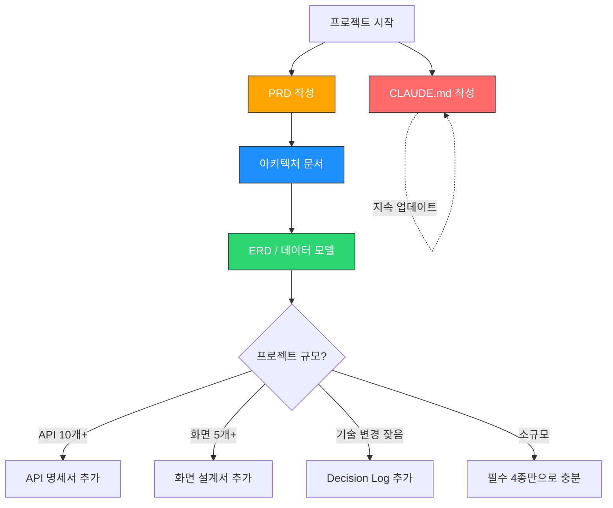

# 1인 바이브코딩 개발자를 위한 개발 문서 체계 가이드

> **대상**: Claude Code를 주력으로 사용하는 1인 개발자  
> **목적**: 사람이 읽고 + 코딩 에이전트에게 컨텍스트로 제공하는 실전 문서 체계  
> **원칙**: 최소 문서, 최대 효과 — 오버스펙 금지

---

## 가이드 구성

| # | 문서 | 내용 |
|---|------|------|
| 01 | [개발 문서 종류 정리](./01-document-types.md) | 필수/권장/불필요 문서 분류, 각 문서의 목적과 에이전트 활용도 |
| 02 | [코딩 에이전트 친화적 문서 포맷](./02-agent-friendly-formats.md) | Markdown, Mermaid, PlantUML, draw.io 등 포맷 비교 |
| 03 | [각 문서의 실전 작성 가이드](./03-practical-writing-guide.md) | 복붙 가능 템플릿, 작성 팁, 안티패턴 |
| 04 | [문서 작성 생산성 도구](./04-productivity-tools.md) | VS Code 확장, Claude Code 활용법, AI 문서 생성 도구 |
| 05 | [기술스택별 문서 작성 전략](./05-tech-stack-strategies.md) | WPF, 웹, 모바일, IoT 등 스택별 문서 차이점 |
| 06 | [바이브코딩 작업 요청 패턴](./06-vibe-coding-patterns.md) | 작업 유형별 프롬프트 템플릿, 문서→프롬프트 워크플로우 |

---

## 빠른 시작 (Quick Start)

```
1. CLAUDE.md를 프로젝트 루트에 생성 → 03번 문서의 템플릿 복붙
2. docs/PRD.md 작성 → 기능 목록 + 우선순위
3. docs/architecture.md 작성 → Mermaid 다이어그램 포함
4. docs/erd.md 작성 → Mermaid erDiagram 포함
5. 에이전트에게 문서 참조시키며 바이브코딩 시작!
```

## 문서 체계 전체 구조


