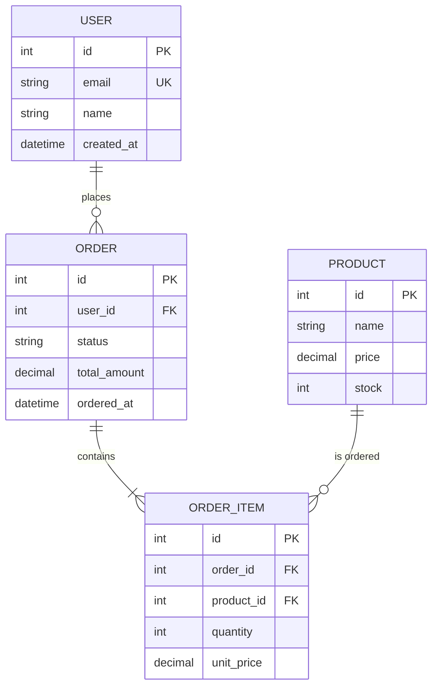
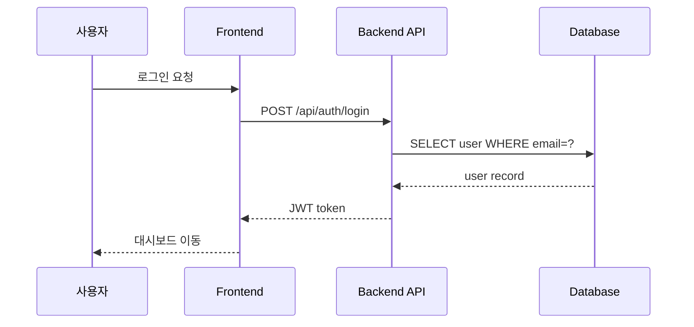

# 02. 코딩 에이전트 친화적 문서 포맷

[← 목차로 돌아가기](./00-index.md) | [← 이전: 01. 문서 종류](./01-document-types.md)

---

### 핵심 요약

```
1순위: Markdown + Mermaid → 에이전트가 완벽히 이해, Git 친화적
2순위: PlantUML → 에이전트 이해 가능, 문법이 다소 장황
3순위: draw.io XML → 에이전트가 부분적으로 이해, 사람에겐 시각적으로 우수
비추: 이미지(PNG/JPG) 기반 문서 → 에이전트가 읽을 수 없음
```

---

## 2.1 포맷별 상세 비교

| 비교 기준 | **Markdown** | **Mermaid** | **PlantUML** | **draw.io** | **Eraser.io** |
|-----------|:---:|:---:|:---:|:---:|:---:|
| 에이전트 파싱/이해 | ★★★★★ | ★★★★★ | ★★★★☆ | ★★☆☆☆ | ★★☆☆☆ |
| 작성 난이도 | 매우 쉬움 | 쉬움 | 보통 | 쉬움(GUI) | 쉬움(GUI) |
| 학습 곡선 | 거의 없음 | 30분 | 1~2시간 | 거의 없음 | 거의 없음 |
| Git 친화성 | ★★★★★ | ★★★★★ | ★★★★★ | ★★★☆☆ | ★☆☆☆☆ |
| 에이전트 생성 가능 | ✅ 직접 작성 | ✅ 직접 생성 | ✅ 직접 생성 | ❌ 불가 | ❌ 불가 |
| 렌더링 환경 | 어디서든 | GitHub, VS Code | 플러그인 필요 | 전용 에디터 | 웹 전용 |

---

## 2.2 각 포맷의 장단점 상세

### Markdown (순수 텍스트)

**장점:**
- 코딩 에이전트가 100% 파싱/이해/생성 가능
- 어떤 에디터에서든 편집 가능
- Git diff가 깔끔하게 보임
- CLAUDE.md, PRD, API 명세 등 거의 모든 문서에 적합

**단점:**
- 복잡한 관계(ERD, 시퀀스 다이어그램)를 텍스트만으로 표현하기 어려움
- 시각적 임팩트가 약함

**최적 용도:** PRD, CLAUDE.md, API 명세서, Decision Log, 기술 문서 전반

### Mermaid (다이어그램 as code)

**장점:**
- Markdown 코드블록 안에 작성 → 하나의 .md 파일로 관리
- GitHub에서 자동 렌더링
- 에이전트가 Mermaid 코드를 읽고/생성/수정 가능
- ERD, 시퀀스, 플로우차트, 클래스 다이어그램 모두 지원

**단점:**
- 매우 복잡한 다이어그램은 가독성 저하
- 레이아웃 자동 배치라 미세 조정 불가

**최적 용도:** ERD, 아키텍처 다이어그램, 시퀀스 다이어그램, 상태 머신

**Mermaid 기본 문법 입문 (5분 속성):**

Mermaid는 Markdown 코드블록 안에 텍스트로 다이어그램을 그린다. 자주 쓰는 4가지 유형:

```
① 플로우차트 (flowchart / graph)
┌─────────────────────────────────┐
│ graph TD                        │  ← TD: 위→아래, LR: 왼→오른
│     A[시작] --> B{조건}         │  ← []: 사각형, {}: 다이아몬드
│     B -->|Yes| C[처리]          │  ← -->|텍스트|: 라벨이 있는 화살표
│     B -->|No| D[종료]           │
└─────────────────────────────────┘

② ERD (erDiagram)
┌─────────────────────────────────┐
│ erDiagram                       │
│     USER ||--o{ ORDER : places  │  ← ||--o{: 1:N 관계
│     USER {                      │     ||--|{: 1:N (필수)
│         int id PK               │     }o--o{: N:M
│         string name             │
│     }                           │
└─────────────────────────────────┘

③ 시퀀스 다이어그램 (sequenceDiagram)
┌─────────────────────────────────┐
│ sequenceDiagram                 │
│     A->>B: 요청                 │  ← ->>: 실선 화살표 (요청)
│     B-->>A: 응답                │  ← -->>: 점선 화살표 (응답)
└─────────────────────────────────┘

④ 상태 다이어그램 (stateDiagram-v2)
┌─────────────────────────────────┐
│ stateDiagram-v2                 │
│     [*] --> Pending             │  ← [*]: 시작/종료 상태
│     Pending --> Paid : 결제     │  ← 상태 --> 상태 : 이벤트
│     Paid --> Shipped            │
└─────────────────────────────────┘
```

> **팁**: Mermaid 문법을 외울 필요 없다. 에이전트에게 "이 구조를 Mermaid 다이어그램으로 그려줘"라고 요청하면 자동 생성해준다. 위 기본 구조만 알면 결과를 읽고 수정할 수 있다.

**실제 예시 — ERD:**


**실제 예시 — 시퀀스 다이어그램:**


### PlantUML

**장점:**
- Mermaid보다 표현력이 풍부 (복잡한 클래스 다이어그램에 유리)
- 에이전트가 문법을 이해하고 생성 가능

**단점:**
- Java 런타임 또는 서버 필요 (렌더링)
- GitHub에서 네이티브 렌더링 미지원
- Mermaid 대비 생태계가 좁아지는 추세

**최적 용도:** 복잡한 클래스 다이어그램, 대규모 시퀀스 다이어그램 (일반적으로 Mermaid로 충분)

### draw.io / Eraser.io (GUI 다이어그램 도구)

**장점:**
- 시각적으로 아름다운 다이어그램
- 드래그 앤 드롭으로 빠른 작성
- draw.io는 XML 형태로 Git 저장 가능

**단점:**
- **코딩 에이전트가 내용을 파싱하기 매우 어려움** (XML/독자 포맷)
- draw.io XML의 Git diff는 사람이 읽기 어려움
- 에이전트에게 컨텍스트로 제공 불가능

**최적 용도:** 외부 발표/문서화용 (에이전트 협업이 아닌 사람 간 소통용)

---

## 2.3 문서 종류별 최적 포맷 매칭

| 문서 종류 | 1순위 포맷 | 2순위 포맷 | 비고 |
|-----------|-----------|-----------|------|
| **CLAUDE.md** | Markdown | — | 순수 텍스트 필수 |
| **PRD** | Markdown | — | 기능 목록, 우선순위 표 |
| **아키텍처 다이어그램** | Mermaid (flowchart) | PlantUML | 레이어 구조, 컴포넌트 관계 |
| **ERD** | Mermaid (erDiagram) | PlantUML | 엔티티 관계, 필드 정의 |
| **시퀀스 다이어그램** | Mermaid (sequence) | PlantUML | API 호출 흐름, 인증 플로우 |
| **API 명세서** | Markdown (표) | OpenAPI/YAML | 엔드포인트별 정리 |
| **화면 설계서** | Markdown (텍스트 와이어프레임) | Excalidraw | ASCII art 또는 텍스트 설명 |
| **상태 다이어그램** | Mermaid (stateDiagram) | PlantUML | 주문 상태, 워크플로우 |
| **Decision Log** | Markdown | — | 날짜 + 결정 + 이유 |

---

## 2.4 결론: 바이브코딩 최적 조합

```
프로젝트 루트/
├── CLAUDE.md              ← Markdown (프로젝트 루트)
├── docs/
│   ├── PRD.md             ← Markdown
│   ├── architecture.md    ← Markdown + Mermaid 다이어그램
│   ├── erd.md             ← Markdown + Mermaid erDiagram
│   ├── api-spec.md        ← Markdown 표
│   └── decisions.md       ← Markdown
```

> **원칙: "Markdown + Mermaid" 조합이면 1인 바이브코딩의 모든 문서를 커버할 수 있다.**  
> 에이전트가 읽고, 생성하고, 수정할 수 있으며, Git으로 버전 관리되고, GitHub에서 렌더링된다.

---

[다음: 03. 각 문서의 실전 작성 가이드 →](./03-practical-writing-guide.md)
