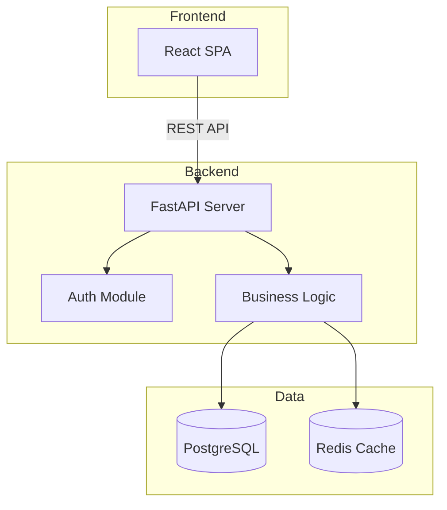
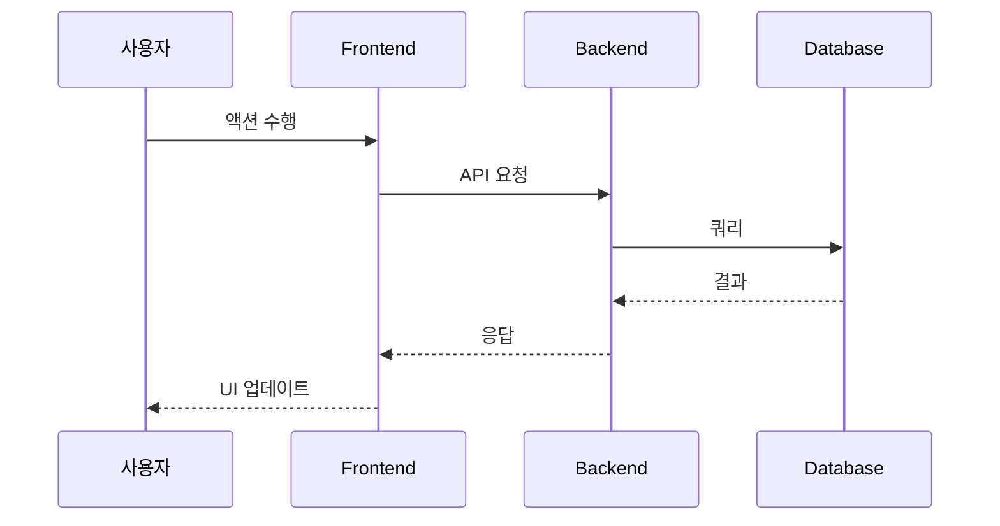
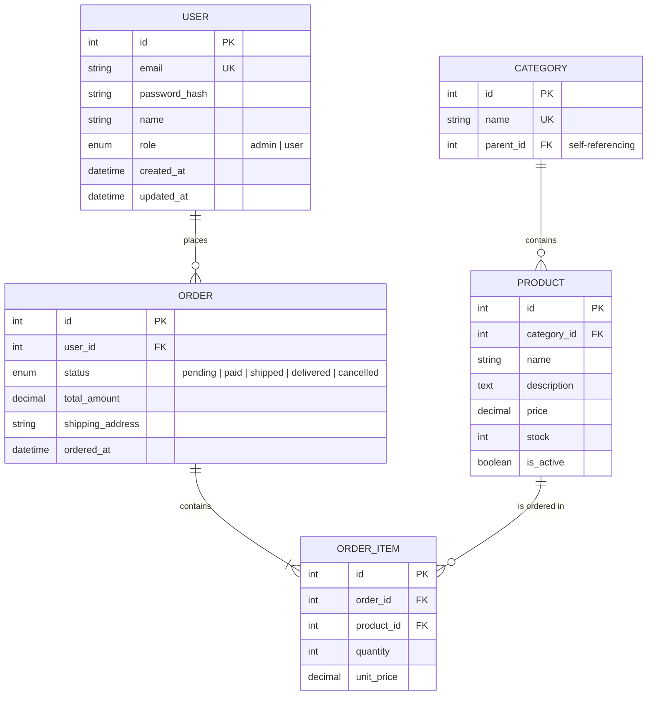
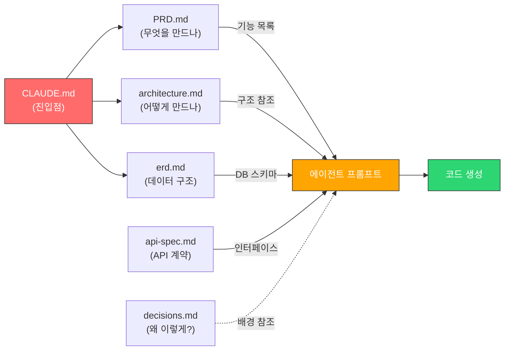

# 03. 각 문서의 실전 작성 가이드

[← 목차로 돌아가기](./00-index.md) | [← 이전: 02. 문서 포맷](./02-agent-friendly-formats.md)

---

### 핵심 요약

```
각 필수 문서에 대해:
① 복붙 가능한 템플릿
② 작성 팁 & 안티패턴
③ 에이전트에게 전달하는 방법
을 제공한다.
```

---

## 3.1 CLAUDE.md — 프로젝트 컨텍스트 파일

### 템플릿

````markdown
# 프로젝트명

## 개요
[한 문장으로 프로젝트 설명]

## 기술 스택
- **언어**: 
- **프레임워크**: 
- **DB**: 
- **주요 라이브러리**: 

## 프로젝트 구조
```
src/
├── models/          # 데이터 모델
├── views/           # UI 컴포넌트
├── controllers/     # 비즈니스 로직
├── services/        # 외부 API 연동
└── utils/           # 유틸리티 함수
```

## 코딩 컨벤션
- [네이밍 규칙, 패턴, 주의사항 등]
- [예: "함수명은 camelCase, 클래스는 PascalCase"]
- [예: "에러 처리는 Result 패턴 사용"]

## 빌드 & 실행
- **빌드**: `npm run build`
- **개발**: `npm run dev`
- **테스트**: `npm test`

## 현재 상태
- [진행 중인 작업 또는 알려진 이슈]

## 주의사항
- [에이전트가 코드 생성 시 반드시 지켜야 할 규칙]
- [예: "절대 any 타입 사용 금지"]
- [예: "DB 직접 접근 금지, 반드시 Repository 패턴 사용"]
````

### 작성 팁

- **구체적으로 쓰라**: "깔끔한 코드 작성" → ❌ | "함수당 20줄 이내, 파라미터 3개 이내" → ✅
- **금지 사항을 명시하라**: 에이전트가 하지 말아야 할 것을 적으면 실수가 줄어든다
- **프로젝트 구조는 실제 디렉토리와 일치시켜라**: 에이전트가 파일을 찾는 데 사용
- **지속 업데이트하라**: 새 패키지 추가, 구조 변경 시마다 반영

### 보안 주의사항 — CLAUDE.md에 절대 넣지 말 것

> CLAUDE.md는 Git에 커밋되며, 에이전트가 읽는 공개 문서다. 민감 정보를 포함하면 보안 사고로 이어진다.

| 절대 넣지 말 것 | 대안 |
|----------------|------|
| API 키, 시크릿 키 | `.env` 파일에 저장, CLAUDE.md에는 "`.env` 참조"로만 언급 |
| DB 비밀번호, 접속 정보 | `.env` 또는 비밀 관리 도구 (Vault, AWS Secrets Manager) |
| 개인 정보 (이메일, 전화번호) | 테스트 데이터는 가짜 값 사용 |
| 내부 서버 IP/도메인 | 환경변수로 관리, 문서에는 `{SERVER_URL}` 플레이스홀더 |
| OAuth 클라이언트 시크릿 | `.env`에 저장 |
| SSH 키, 인증서 내용 | 키 경로만 기재 (예: `~/.ssh/deploy_key`) |

**올바른 예시:**
```markdown
## 환경 변수
- `.env` 파일에 설정 (`.env.example` 참조)
- 필수 환경변수: DATABASE_URL, JWT_SECRET, REDIS_URL
- 에이전트에게: "환경변수는 .env.example을 참조하고, 실제 값은 넣지 마"
```

**나쁜 예시:**
```markdown
## DB 접속 정보
- Host: 192.168.1.100
- Password: MyS3cretP@ss!   ← 절대 금지
- API Key: sk-abc123...      ← 절대 금지
```

### 안티패턴

| 안티패턴 | 왜 나쁜가 | 올바른 방법 |
|---------|----------|------------|
| 10페이지 이상 장문 | 에이전트가 핵심을 놓침 | 1~3페이지로 핵심만 |
| "좋은 코드를 작성하세요" 같은 모호한 지시 | 에이전트가 해석을 못함 | 구체적 규칙과 예시 |
| 프로젝트 구조가 실제와 다름 | 에이전트가 없는 파일을 참조 | 실제 구조와 동기화 |
| 한 번 작성 후 방치 | 구조가 변하면 오히려 혼란 | 주기적 업데이트 |

### 에이전트에게 전달하는 방법

CLAUDE.md는 **프로젝트 루트에 두면 자동으로 로드**된다. 별도 전달 불필요.

```
프로젝트 루트/
├── CLAUDE.md          ← Claude Code가 자동 인식
├── src/
├── package.json
└── ...
```

하위 디렉토리에도 CLAUDE.md를 둘 수 있다 (해당 디렉토리 작업 시 추가 컨텍스트):
```
src/
├── CLAUDE.md          ← src/ 하위 작업 시 추가 로드
├── components/
│   └── CLAUDE.md      ← 컴포넌트 관련 작업 시 추가 로드
└── ...
```

---

## 3.2 PRD (경량 Product Requirements Document)

### 템플릿

````markdown
# [프로젝트명] PRD

## 1. 프로젝트 목적
[이 프로젝트가 해결하는 문제를 2~3문장으로]

## 2. 대상 사용자
- [주요 사용자 그룹 1]: [특성]
- [주요 사용자 그룹 2]: [특성]

## 3. 핵심 기능 목록

### P0 (필수 — MVP)
| # | 기능명 | 설명 | 완료 기준 |
|---|--------|------|----------|
| 1 | 사용자 인증 | 이메일/비밀번호 로그인, 회원가입 | 로그인 후 대시보드 접근 가능 |
| 2 | 대시보드 | 주요 지표 요약 표시 | 매출, 주문수, 신규회원 표시 |
| 3 | ... | ... | ... |

### P1 (중요 — MVP 이후)
| # | 기능명 | 설명 | 완료 기준 |
|---|--------|------|----------|
| 4 | 알림 설정 | 이메일/푸시 알림 설정 | 알림 ON/OFF 토글 동작 |

### P2 (나중에)
| # | 기능명 | 설명 |
|---|--------|------|
| 5 | 다국어 지원 | 한/영 전환 |

## 4. 핵심 유저 시나리오
1. **회원가입 → 첫 주문**: 사용자가 회원가입 후 상품을 검색하고 첫 주문을 완료
2. **재방문 → 재주문**: 로그인 후 주문 내역에서 재주문
3. ...

## 5. 비기능 요구사항
- 페이지 로딩: 3초 이내
- 동시 접속: 100명 이상
- 모바일 반응형 지원

## 6. 제약사항 / 기술 결정
- [예: "외부 결제 API는 Toss Payments 사용"]
- [예: "이미지 저장은 S3, CDN은 CloudFront"]
````

### 작성 팁

- **P0/P1/P2 우선순위를 반드시 매겨라**: 에이전트에게 "P0부터 구현해줘"라고 하면 작업 순서가 명확
- **완료 기준을 구체적으로**: "동작하면 됨" → ❌ | "로그인 후 JWT 토큰 발급, 토큰으로 API 호출 가능" → ✅
- **유저 시나리오는 end-to-end로**: 단일 기능이 아닌 사용자의 여정을 기술

### 안티패턴

| 안티패턴 | 왜 나쁜가 | 올바른 방법 |
|---------|----------|------------|
| 우선순위 없는 기능 나열 | 에이전트가 뭘 먼저 해야 할지 모름 | P0/P1/P2 분류 |
| "~하면 좋겠다" 같은 모호한 기능 | 구현 범위가 불명확 | 완료 기준 명시 |
| 50개 기능 나열 | 1인 개발 현실과 괴리 | MVP 10개 이내 |
| 기술 결정 누락 | 에이전트가 임의 선택 | 기술 제약 사전 명시 |

### 에이전트에게 전달하는 방법

```
# 새 기능 개발 시 프롬프트 예시
"PRD.md의 P0-1 '사용자 인증' 기능을 구현해줘.
기술 스택은 CLAUDE.md 참조.
이메일/비밀번호 로그인, JWT 토큰 발급, 토큰 검증 미들웨어를 포함해줘."
```

---

## 3.3 아키텍처 문서 (Architecture Overview)

### 템플릿

````markdown
# [프로젝트명] 아키텍처

## 1. 시스템 개요
[아키텍처를 한 문장으로 설명]
예: "React SPA + FastAPI 백엔드 + PostgreSQL, Docker 컨테이너 배포"

## 2. 아키텍처 다이어그램



## 3. 레이어 구조

| 레이어 | 역할 | 디렉토리 | 주요 패턴 |
|--------|------|---------|----------|
| Presentation | UI 렌더링, 사용자 입력 | `src/components/` | 컴포넌트 기반 |
| Application | 유스케이스 처리 | `src/services/` | 서비스 패턴 |
| Domain | 비즈니스 규칙 | `src/models/` | 도메인 모델 |
| Infrastructure | DB, 외부 API | `src/repositories/` | Repository 패턴 |

## 4. 핵심 데이터 흐름



## 5. 기술 선택 근거
| 기술 | 선택 이유 |
|------|----------|
| FastAPI | 비동기 지원, 자동 API 문서 생성, 타입 힌트 기반 |
| PostgreSQL | 트랜잭션 안정성, JSON 지원, 풍부한 에코시스템 |
| Redis | 세션 캐시, 빈번한 읽기 캐싱 |

## 6. 디렉토리 구조 규칙
- 새 도메인 추가 시 `src/domains/[도메인명]/` 하위에 model, service, repository 생성
- 공통 유틸은 `src/shared/`에 배치
- 테스트는 소스 옆에 `__tests__/` 폴더
````

### 작성 팁

- **Mermaid 다이어그램은 반드시 포함하라**: 텍스트만으로는 구조 파악이 어렵다
- **레이어 간 의존성 방향을 명시하라**: "Controller → Service → Repository (역방향 금지)"
- **디렉토리 구조와 매핑하라**: 에이전트가 파일을 어디에 만들지 알 수 있다
- **기술 선택 근거를 남겨라**: 에이전트가 호환되는 라이브러리를 선택하는 데 도움

### 안티패턴

| 안티패턴 | 왜 나쁜가 | 올바른 방법 |
|---------|----------|------------|
| 다이어그램 없이 텍스트만 | 구조 파악이 어려움 | Mermaid 다이어그램 필수 |
| draw.io 이미지만 첨부 | 에이전트가 읽을 수 없음 | Mermaid 코드로 작성 |
| 모든 클래스를 다 그림 | 핵심 구조가 묻힘 | 주요 컴포넌트만 표시 |
| 실제 코드와 괴리 | 에이전트가 잘못된 구조로 코드 생성 | 코드 변경 시 동기화 |

### 에이전트에게 전달하는 방법

```
# 새 모듈 추가 시 프롬프트 예시
"architecture.md의 레이어 구조를 참고해서 '알림' 도메인을 추가해줘.
src/domains/notification/ 하위에 model, service, repository를 생성하고,
기존 패턴과 동일하게 구현해줘."
```

---

## 3.4 데이터 모델 / ERD 문서

### 템플릿

````markdown
# [프로젝트명] 데이터 모델

## 1. ERD



## 2. 엔티티 설명

### USER
- 서비스 사용자. role 필드로 관리자/일반 사용자 구분
- password_hash: bcrypt 해시 저장, 평문 저장 금지

### ORDER
- status 흐름: pending → paid → shipped → delivered
- cancelled는 pending, paid 상태에서만 가능

## 3. 인덱스 전략
| 테이블 | 인덱스 | 이유 |
|--------|--------|------|
| USER | email (UNIQUE) | 로그인 시 조회 |
| ORDER | user_id + ordered_at | 사용자별 주문 내역 조회 |
| PRODUCT | category_id + is_active | 카테고리별 활성 상품 조회 |

## 4. 마이그레이션 히스토리
| 버전 | 날짜 | 변경 내용 |
|------|------|----------|
| v1 | 2024-01-15 | 초기 스키마 생성 |
| v2 | 2024-02-01 | ORDER에 shipping_address 추가 |
````

### 작성 팁

- **Mermaid erDiagram을 필수로 사용하라**: 에이전트가 관계를 정확히 이해
- **필드 타입과 제약조건을 명시하라**: PK, FK, UK, NOT NULL 등
- **상태(enum) 값의 흐름을 설명하라**: 에이전트가 비즈니스 로직 구현 시 참조
- **인덱스 전략을 포함하라**: 에이전트가 쿼리 작성 시 성능을 고려

### 안티패턴

| 안티패턴 | 왜 나쁜가 | 올바른 방법 |
|---------|----------|------------|
| 테이블만 나열, 관계 누락 | JOIN 쿼리를 잘못 생성 | 관계를 명시적으로 표현 |
| 필드 타입 누락 | 에이전트가 타입을 추측 | 모든 필드에 타입 명시 |
| 이미지 ERD만 존재 | 에이전트가 읽을 수 없음 | Mermaid 코드로 작성 |
| 마이그레이션 히스토리 누락 | 스키마 변경 이력 추적 불가 | 변경 이력 기록 |

### 에이전트에게 전달하는 방법

```
# DB 관련 작업 시 프롬프트 예시
"erd.md를 참고해서 ORDER 테이블에 대한 CRUD API를 구현해줘.
status 필드의 상태 전이 규칙(pending→paid→shipped→delivered)을 지켜줘.
인덱스 전략에 맞게 쿼리를 최적화해줘."
```

---

## 3.5 API 명세서 (권장)

### 템플릿

````markdown
# [프로젝트명] API 명세서

## 공통 사항

### Base URL
- 개발: `http://localhost:8000/api`
- 운영: `https://api.example.com/api`

### 인증
- Bearer Token (JWT)
- 헤더: `Authorization: Bearer {access_token}`
- 토큰 만료: access 30분, refresh 7일

### 공통 에러 응답
| 코드 | 의미 | 응답 예시 |
|------|------|----------|
| 401 | 인증 실패 | `{"detail": "Not authenticated"}` |
| 403 | 권한 없음 | `{"detail": "Permission denied"}` |
| 404 | 리소스 없음 | `{"detail": "Not found"}` |
| 422 | 유효성 검증 실패 | `{"detail": [{"field": "email", "msg": "invalid format"}]}` |

---

## 엔드포인트

### 인증 (Auth)

#### POST /auth/login
로그인하여 JWT 토큰을 발급받는다.

**Request:**
```json
{
    "email": "user@example.com",
    "password": "password123"
}
```

**Response (200):**
```json
{
    "access_token": "eyJ...",
    "refresh_token": "eyJ...",
    "token_type": "bearer"
}
```

**에러:**
- 401: 이메일 또는 비밀번호 불일치

---

### 사용자 (Users)

#### GET /users/me
현재 로그인한 사용자 정보 조회. 인증 필요.

**Response (200):**
```json
{
    "id": 1,
    "email": "user@example.com",
    "name": "홍길동",
    "role": "user",
    "created_at": "2024-01-15T09:00:00Z"
}
```

---

### 주문 (Orders)

#### GET /orders
내 주문 목록 조회. 인증 필요. 페이지네이션 지원.

**Query Parameters:**
| 파라미터 | 타입 | 필수 | 기본값 | 설명 |
|---------|------|:---:|-------|------|
| page | int | N | 1 | 페이지 번호 |
| size | int | N | 20 | 페이지당 항목 수 (최대 100) |
| status | string | N | — | 상태 필터 (pending, paid, shipped 등) |

**Response (200):**
```json
{
    "items": [
        {
            "id": 1,
            "status": "paid",
            "total_amount": 35000,
            "ordered_at": "2024-02-01T14:30:00Z"
        }
    ],
    "total": 42,
    "page": 1,
    "size": 20
}
```

#### POST /orders
새 주문 생성. 인증 필요.

**Request:**
```json
{
    "items": [
        {"product_id": 1, "quantity": 2},
        {"product_id": 5, "quantity": 1}
    ],
    "shipping_address": "서울시 강남구 역삼동 123-45"
}
```

**Response (201):**
```json
{
    "id": 43,
    "status": "pending",
    "total_amount": 55000,
    "ordered_at": "2024-02-15T10:00:00Z"
}
```

**에러:**
- 400: 재고 부족 `{"detail": "Insufficient stock for product_id: 5"}`
````

### 작성 팁

- **공통 사항을 먼저 정리하라**: Base URL, 인증, 에러 코드를 한 번만 쓰면 엔드포인트별 중복이 줄어듦
- **요청/응답 JSON 예시를 반드시 포함하라**: 에이전트가 타입을 정확히 파악
- **에러 케이스를 명시하라**: 에이전트가 프론트엔드 에러 핸들링 코드를 정확히 생성
- **페이지네이션 규격을 통일하라**: 모든 목록 API에 동일한 파라미터/응답 구조 적용

### 에이전트에게 전달하는 방법

```
# 프론트엔드 API 연동 시 프롬프트 예시
"docs/api-spec.md의 '주문 (Orders)' 섹션을 참고해서
주문 목록 페이지의 데이터 페칭 훅(useOrders)을 구현해줘.
페이지네이션, 상태 필터, 에러 핸들링을 포함해줘."
```

---

## 3.6 Decision Log (권장)

### 템플릿

````markdown
# [프로젝트명] Decision Log

> 주요 기술 결정과 그 이유를 기록한다.
> "3개월 뒤의 나"와 "코딩 에이전트"가 참조하는 문서.

## 결정 기록

### [DEC-001] 상태 관리 라이브러리 선택
- **날짜**: 2024-01-10
- **결정**: Zustand 채택 (Redux, Jotai 대신)
- **이유**: 
  - 보일러플레이트가 적어 1인 개발에 적합
  - Redux는 오버스펙 (미들웨어, 액션 타입 등 불필요)
  - Jotai는 atom 단위가 너무 세분화됨
- **영향**: 전역 상태는 `src/stores/` 에 Zustand store로 관리

### [DEC-002] DB를 PostgreSQL에서 SQLite로 변경
- **날짜**: 2024-02-05
- **결정**: 개발 환경 DB를 SQLite로 변경
- **이유**:
  - 1인 개발에서 Docker로 PostgreSQL 띄우는 것이 번거로움
  - 데이터 규모가 작아 SQLite로 충분
  - 운영 환경만 PostgreSQL 유지
- **영향**: SQLAlchemy dialect 분기 처리 필요, 마이그레이션 양쪽 테스트

### [DEC-003] 인증 방식 변경
- **날짜**: 2024-03-01
- **결정**: 세션 기반 → JWT 기반으로 전환
- **이유**:
  - 향후 모바일 앱 추가 가능성 대비
  - 서버 stateless 유지
- **영향**: auth 모듈 전면 교체, 기존 세션 코드 제거
````

### 작성 팁

- **결정 번호를 매겨라** (DEC-001): 다른 문서나 프롬프트에서 "DEC-002 참조"로 인용 가능
- **"이유"에 기각된 대안도 쓰라**: "왜 Redux를 안 썼는가"가 향후 재논의를 방지
- **"영향"을 반드시 기록하라**: 에이전트가 관련 코드를 찾는 데 활용
- **모든 결정을 기록할 필요 없다**: 아키텍처에 영향을 주는 결정만

### 에이전트에게 전달하는 방법

```
# 기술 변경 시 프롬프트 예시
"docs/decisions.md의 DEC-003을 참고해.
세션 기반 인증을 JWT로 전환해야 해.
auth 모듈을 교체하고, 기존 세션 관련 코드를 제거해줘."
```

---

## 3.7 문서 간 연결 구조



> **워크플로우**: CLAUDE.md가 전체 맥락을 잡아주고 → PRD로 "무엇을" 정의하고 → 아키텍처로 "어떻게" 구조를 잡고 → ERD로 데이터를 설계한 뒤 → 이 문서들을 에이전트에게 넘겨서 코드를 생성한다.

---

## 부록: 나쁜 문서 vs 좋은 문서 (Before / After)

> 실제로 자주 보이는 나쁜 패턴과, 같은 내용을 에이전트 친화적으로 고친 예시.

### CLAUDE.md — Before (나쁜 예)

```markdown
# 내 프로젝트

웹 프로젝트입니다. React랑 Node 사용합니다.
코드 깔끔하게 짜주세요.
DB는 몽고DB 쓰다가 포스트그레로 바꿀 수도 있어요.
테스트는 나중에 할게요.
```

**문제점:**
- 프로젝트 구조 없음 → 에이전트가 파일 위치를 추측
- "깔끔하게"는 해석 불가능한 지시
- DB가 미정 → 에이전트가 어떤 ORM/쿼리를 써야 할지 모름
- 버전 정보 없음 → React 18인지 19인지에 따라 코드가 다름

### CLAUDE.md — After (좋은 예)

```markdown
# TaskFlow - 작업 관리 웹앱

## 기술 스택
- **Frontend**: React 18, TypeScript 5.4, TailwindCSS 3.4
- **Backend**: Node.js 20, Express 4, Prisma ORM
- **DB**: PostgreSQL 16
- **테스트**: Vitest (unit), Playwright (e2e)

## 프로젝트 구조
```
src/
├── client/           # React SPA
│   ├── components/   # UI 컴포넌트 (함수형만)
│   ├── hooks/        # Custom hooks
│   └── pages/        # 라우트별 페이지
├── server/           # Express API
│   ├── routes/       # 엔드포인트
│   ├── services/     # 비즈니스 로직
│   └── prisma/       # 스키마, 마이그레이션
```

## 컨벤션
- 컴포넌트: 함수형 + TypeScript, Props 인터페이스 필수
- API 응답: { data, error, message } 통일 포맷
- 에러 처리: 커스텀 AppError 클래스 사용
- any 타입 사용 금지, unknown 후 타입 가드 사용

## 빌드 & 실행
- `npm run dev` — 프론트+백 동시 실행
- `npm test` — Vitest 실행
- `npx prisma migrate dev` — DB 마이그레이션
```

---

### PRD — Before (나쁜 예)

```markdown
# 기능

- 로그인
- 회원가입
- 게시판
- 댓글
- 알림
- 검색
- 설정
- 관리자 페이지
- 통계
- 다국어
- 다크모드
```

**문제점:**
- 우선순위 없음 → 에이전트가 뭘 먼저 할지 모름
- 완료 기준 없음 → "게시판"이 어디까지인지 불명확
- 11개 기능 나열 → 1인 개발로는 비현실적
- 기술 제약 없음 → 에이전트가 임의로 기술 선택

### PRD — After (좋은 예)

```markdown
# TaskFlow PRD

## P0 (MVP — 2주 내 완료)
| # | 기능 | 완료 기준 |
|---|------|----------|
| 1 | 이메일 로그인 | JWT 발급, 토큰으로 API 호출 가능 |
| 2 | 작업 CRUD | 작업 생성/조회/수정/삭제, 상태 변경(todo→doing→done) |
| 3 | 작업 목록 | 상태별 칸반 보드, 드래그 앤 드롭 |

## P1 (MVP 이후)
| # | 기능 | 완료 기준 |
|---|------|----------|
| 4 | 작업 검색 | 키워드 + 상태 필터, 결과 하이라이트 |
| 5 | 알림 | 마감일 24시간 전 이메일 알림 |

## 제약사항
- 결제/과금 기능 없음 (무료 서비스)
- 인증은 이메일+비밀번호만 (소셜 로그인은 P2)
```

---

[다음: 04. 문서 작성 생산성 도구 →](./04-productivity-tools.md)
