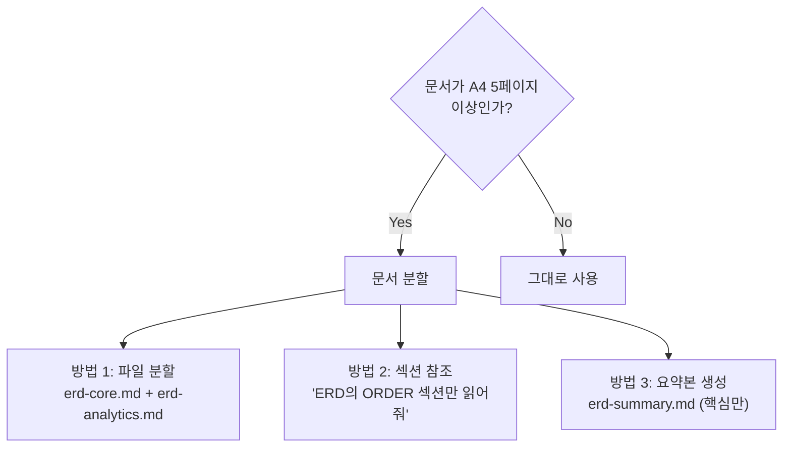

# 04. 문서 작성 생산성 도구

[← 목차로 돌아가기](./00-index.md) | [← 이전: 03. 실전 작성 가이드](./03-practical-writing-guide.md)

---

### 핵심 요약

```
VS Code + Markdown 확장 + Mermaid 프리뷰 = 문서 작성 최적 환경
Claude Code의 CLAUDE.md 자동 로드 + 문서 참조 = 에이전트 연동 최적화
```

---

## 4.1 VS Code 확장 (Extensions)

### Markdown 관련

| 확장 | 용도 | 추천도 |
|------|------|--------|
| **Markdown All in One** | TOC 자동 생성, 단축키, 리스트 자동 포맷 | ★★★★★ |
| **Markdown Preview Enhanced** | 고급 프리뷰 (Mermaid 렌더링 포함) | ★★★★★ |
| **markdownlint** | Markdown 문법 린팅 | ★★★★☆ |
| **Paste Image** | 클립보드 이미지 자동 저장 및 링크 삽입 | ★★★☆☆ |

### Mermaid 관련

| 확장 | 용도 | 추천도 |
|------|------|--------|
| **Mermaid Markdown Syntax Highlighting** | 코드블록 내 Mermaid 문법 하이라이팅 | ★★★★★ |
| **Mermaid Chart** | VS Code 내에서 Mermaid 실시간 프리뷰 | ★★★★☆ |

### 추천 VS Code 설정

```json
// .vscode/settings.json
{
    "markdown.preview.breaks": true,
    "markdown.mermaid.enabled": true,
    "editor.wordWrap": "on",
    "[markdown]": {
        "editor.defaultFormatter": "yzhang.markdown-all-in-one",
        "editor.quickSuggestions": {
            "other": true,
            "comments": false,
            "strings": false
        }
    }
}
```

---

## 4.2 Claude Code 활용

### CLAUDE.md 자동 로드
- 프로젝트 루트의 `CLAUDE.md`는 세션 시작 시 자동으로 읽힘
- 하위 디렉토리의 `CLAUDE.md`는 해당 디렉토리 작업 시 추가 로드
- `~/.claude/CLAUDE.md`에 전역 설정 (모든 프로젝트에 공통 적용)

### 에이전트에게 문서 참조시키기

```bash
# 방법 1: 파일 경로 직접 언급
"docs/erd.md를 읽고 User 테이블에 대한 CRUD API를 만들어줘"

# 방법 2: 프로젝트 문서 일괄 참조
"docs/ 폴더의 PRD.md와 architecture.md를 읽고 
P0-3 '상품 검색' 기능을 구현해줘"

# 방법 3: 문서 업데이트 요청
"현재 코드 구조를 분석해서 CLAUDE.md를 업데이트해줘"
```

### Claude Code의 유용한 기능

| 기능 | 활용법 |
|------|--------|
| **멀티파일 편집** | "PRD의 P0 기능 3개를 한번에 구현해줘" → 여러 파일을 동시에 생성/수정 |
| **Git 연동** | "이 변경사항을 커밋하고 PR 설명도 작성해줘" |
| **코드 → 문서** | "현재 API 엔드포인트를 분석해서 api-spec.md를 생성해줘" |
| **문서 → 코드** | "erd.md를 기반으로 SQLAlchemy 모델을 생성해줘" |

---

## 4.3 AI 기반 문서 자동생성

### 코드 → 문서 생성

| 도구 | 용도 | 특징 |
|------|------|------|
| **Claude Code** | 코드 분석 → 문서 생성 | CLAUDE.md, API 명세 자동 생성 가능 |
| **GitHub Copilot** | 코드 주석 → 문서 | 인라인 문서 생성에 강점 |
| **Mintlify Doc Writer** | VS Code에서 docstring 자동 생성 | 함수/클래스 문서화 |

### 실전 워크플로우: 코드에서 문서 자동 생성

```bash
# 1. ERD 자동 생성 요청
"현재 DB 모델(models/ 폴더)을 분석해서 Mermaid ERD를 생성해줘.
docs/erd.md에 저장해줘."

# 2. API 명세 자동 생성 요청
"현재 라우터(routes/ 폴더)를 분석해서 API 명세서를 생성해줘.
각 엔드포인트의 메서드, 경로, 요청/응답 예시를 포함해줘.
docs/api-spec.md에 저장해줘."

# 3. 아키텍처 문서 자동 생성 요청
"프로젝트 구조를 분석해서 architecture.md를 작성해줘.
Mermaid 다이어그램으로 레이어 구조와 주요 컴포넌트 관계를 표현해줘."
```

---

## 4.4 다이어그램 도구 비교

| 도구 | 유형 | 에이전트 친화성 | Git 친화성 | 비용 |
|------|------|:---:|:---:|------|
| **Mermaid Live Editor** (mermaid.live) | 웹 기반 | ★★★★★ | ★★★★★ | 무료 |
| **Excalidraw** | 웹/VS Code | ★★★☆☆ | ★★★★☆ | 무료 |
| **draw.io** (diagrams.net) | 웹/데스크톱 | ★★☆☆☆ | ★★★☆☆ | 무료 |
| **Eraser.io** | 웹 기반 | ★★☆☆☆ | ★☆☆☆☆ | Freemium |
| **tldraw** | 웹 기반 | ★★☆☆☆ | ★★★☆☆ | 무료 |

### 추천 워크플로우


---

## 4.5 문서 관리 팁

### 폴더 구조 권장안

```
프로젝트 루트/
├── CLAUDE.md                  ← 에이전트 컨텍스트 (루트 필수)
├── docs/
│   ├── PRD.md                 ← 제품 요구사항
│   ├── architecture.md        ← 아키텍처 개요
│   ├── erd.md                 ← 데이터 모델
│   ├── api-spec.md            ← API 명세 (권장)
│   ├── ui-wireframe.md        ← 화면 설계 (권장)
│   └── decisions.md           ← 결정 이력 (권장)
├── src/
│   └── CLAUDE.md              ← 소스 코드 관련 추가 컨텍스트 (선택)
└── ...
```

### 문서 업데이트 주기

| 문서 | 업데이트 트리거 |
|------|----------------|
| CLAUDE.md | 패키지 추가/제거, 디렉토리 구조 변경, 컨벤션 변경 시 |
| PRD | 기능 추가/제거, 우선순위 변경 시 |
| 아키텍처 | 새 레이어/모듈 추가, 기술 스택 변경 시 |
| ERD | 테이블 추가/변경, 관계 변경 시 |

### 문서 최신화 체크리스트

> 문서가 코드와 괴리되면, 에이전트에게 **잘못된 컨텍스트**를 주는 것이다. 아래 체크리스트를 주기적으로(2주마다 또는 마일스톤마다) 점검하라.

#### CLAUDE.md 점검
- [ ] `프로젝트 구조` 섹션이 실제 디렉토리와 일치하는가?
- [ ] `기술 스택`의 버전이 package.json / requirements.txt와 일치하는가?
- [ ] `빌드 & 실행` 명령어가 실제로 동작하는가?
- [ ] 삭제된 패키지나 더 이상 쓰지 않는 패턴이 남아있지 않은가?
- [ ] `주의사항`에 새로 추가해야 할 규칙이 있는가?

#### PRD 점검
- [ ] 완료된 기능에 체크 표시가 되어 있는가?
- [ ] 새로 추가된 기능이 PRD에 반영되어 있는가?
- [ ] 우선순위가 현실과 맞는가? (P1이 P0으로 올라갔거나 삭제되었거나)

#### 아키텍처 점검
- [ ] Mermaid 다이어그램이 현재 컴포넌트 구조와 일치하는가?
- [ ] 새로 추가된 모듈/서비스가 다이어그램에 반영되어 있는가?
- [ ] 레이어 간 의존성 방향이 실제 코드와 일치하는가?

#### ERD 점검
- [ ] 새로 추가된 테이블/컬럼이 ERD에 반영되어 있는가?
- [ ] 삭제된 필드가 ERD에서 제거되었는가?
- [ ] 마이그레이션 히스토리가 최신인가?

> **자동화 팁**: 에이전트에게 "현재 코드와 docs/ 문서를 비교해서 불일치하는 부분을 찾아줘"라고 요청하면 차이점을 잡아준다.

---

## 4.6 문서 크기와 컨텍스트 윈도우 관리

> 에이전트에게 문서를 넘길 때, **문서 크기가 곧 컨텍스트 윈도우 비용**이다. 문서가 너무 크면 실제 코드를 읽을 공간이 줄어든다.

### 문서별 권장 크기

| 문서 | 권장 크기 | 토큰 기준 (대략) | 초과 시 문제 |
|------|----------|:---:|------------|
| **CLAUDE.md** | A4 1~2페이지 | ~1,000 토큰 | 핵심 컨벤션이 묻혀서 무시됨 |
| **PRD** | A4 2~5페이지 | ~2,500 토큰 | 기능 우선순위가 흐려짐 |
| **아키텍처** | A4 1~3페이지 | ~1,500 토큰 | 주요 레이어 관계가 희석됨 |
| **ERD** | A4 1~2페이지 | ~1,000 토큰 | 핵심 테이블이 묻힘 |
| **API 명세** | 엔드포인트당 ~15줄 | 엔드포인트 x ~100 토큰 | 전체 로드 시 컨텍스트 과부하 |

### 큰 문서를 다루는 전략



**실전 팁:**
- **API 명세가 50개 이상이면 분할하라**: `api-spec-auth.md`, `api-spec-orders.md` 등 도메인별 분리
- **에이전트에게 전체 문서를 넘기지 말고 필요한 섹션만 지정하라**: "erd.md의 ORDER 관련 부분만 참고해줘"
- **CLAUDE.md는 절대 3페이지를 넘기지 마라**: 가장 자주 로드되는 문서이므로 짧을수록 좋다
- **에이전트에게 문서 요약을 요청할 수 있다**: "이 PRD를 핵심 기능 10개로 요약해줘"

---

[다음: 05. 기술스택별 문서 작성 전략 →](./05-tech-stack-strategies.md)
