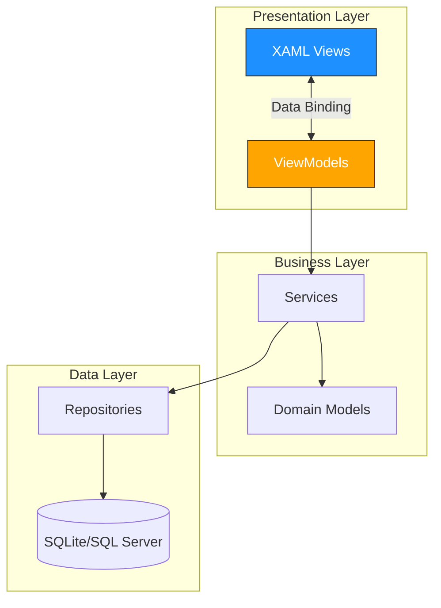
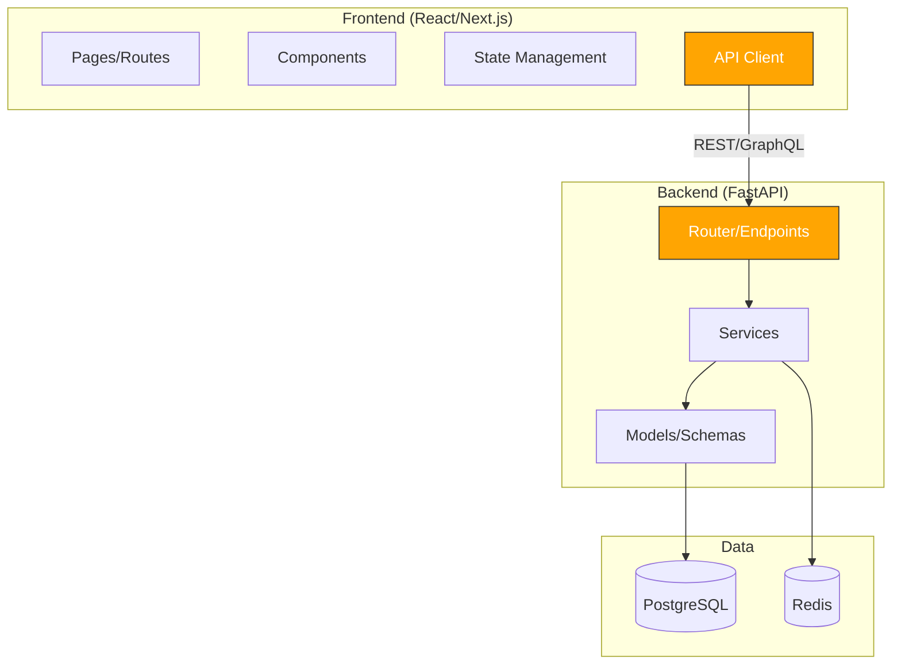
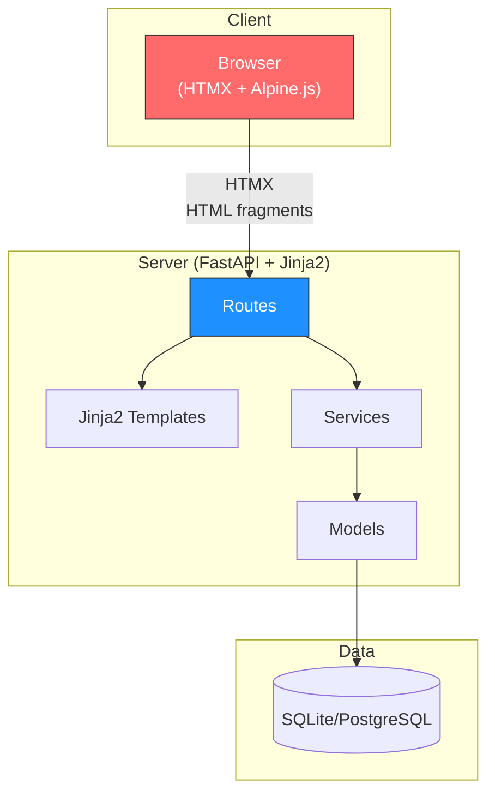
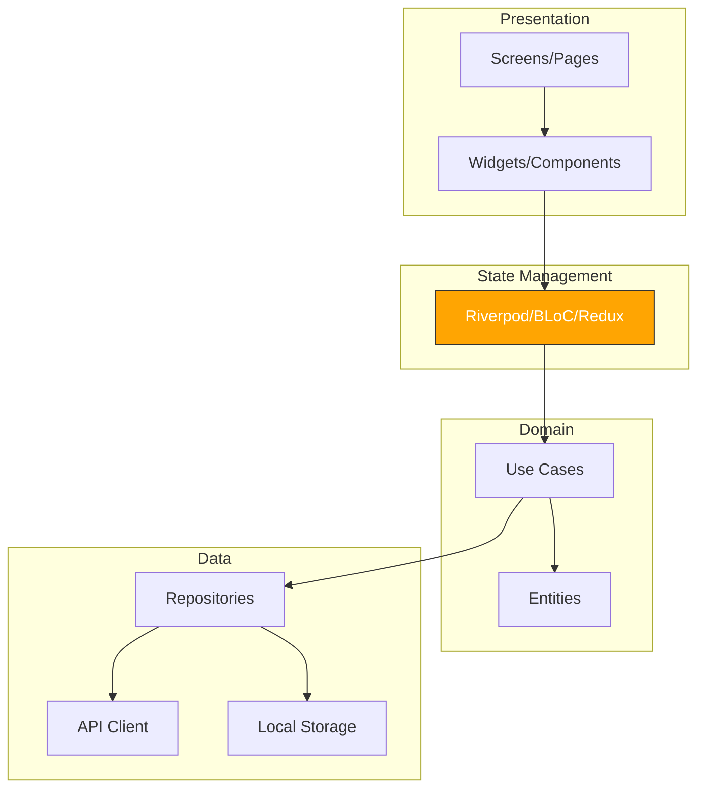
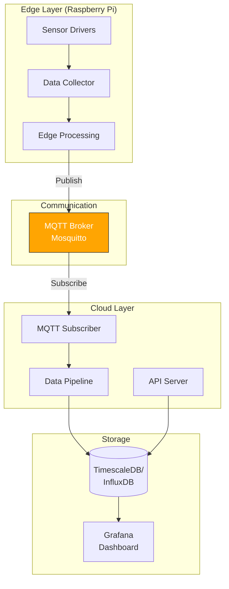

# 05. 기술스택별 문서 작성 전략

[← 목차로 돌아가기](./00-index.md) | [← 이전: 04. 생산성 도구](./04-productivity-tools.md)

---

### 핵심 요약

```
기술스택에 따라:
- 필수 문서의 비중이 달라진다 (웹은 API 명세 필수, 데스크톱은 화면 설계 비중 큼)
- 아키텍처 문서에서 강조할 레이어가 다르다
- CLAUDE.md에 기술스택 고유의 컨텍스트를 반영해야 한다
```

---

## 전체 비교표

| 문서 항목 | 데스크톱 (WPF/C#) | 웹 풀스택 (React+FastAPI) | 웹 경량 (HTMX+FastAPI) | 모바일 (Flutter) | IoT/Edge (Python+MQTT) |
|-----------|:---:|:---:|:---:|:---:|:---:|
| **CLAUDE.md** | 필수 | 필수 | 필수 | 필수 | 필수 |
| **PRD** | 필수 | 필수 | 필수 | 필수 | 필수 |
| **아키텍처** | 필수 (MVVM 강조) | 필수 (FE↔BE↔DB) | 필수 (서버사이드) | 필수 (위젯 트리) | 필수 (디바이스↔클라우드) |
| **ERD** | 중요 | 필수 | 필수 | 중요 | 중요 (시계열 DB) |
| **API 명세** | 낮음 | 필수 | 중간 | 필수 | 필수 (MQTT 토픽) |
| **화면 설계** | 높음 | 중간 | 낮음 | 높음 | 낮음 |
| **상태 다이어그램** | 높음 | 중간 | 낮음 | 높음 | 높음 (디바이스 상태) |

---

## 5.1 데스크톱 (WPF/WinForms + C#)

### 아키텍처 문서에서 강조할 레이어



### 문서 작성 포인트
- **화면 설계서 비중이 높다**: WPF는 XAML 레이아웃이 복잡하므로, 각 화면의 컴포넌트 배치와 데이터 바인딩 관계를 문서화
- **MVVM 패턴 명시 필수**: ViewModel과 View의 매핑 관계를 명확히
- **상태 관리**: 화면 간 네비게이션, 다이얼로그 흐름을 상태 다이어그램으로 표현
- **API 명세서는 불필요**: 대부분 로컬 DB 직접 접근

### CLAUDE.md 예시

```markdown
# ProSafe - 안전 관리 데스크톱 앱

## 기술 스택
- **언어**: C# 12, .NET 8
- **UI 프레임워크**: WPF (MVVM 패턴)
- **DB**: SQLite (Entity Framework Core)
- **DI**: Microsoft.Extensions.DependencyInjection
- **MVVM 프레임워크**: CommunityToolkit.Mvvm

## 프로젝트 구조
```
ProSafe/
├── Views/              # XAML 화면 (View)
│   ├── MainWindow.xaml
│   ├── DashboardView.xaml
│   └── InspectionView.xaml
├── ViewModels/         # ViewModel (ObservableObject 상속)
│   ├── MainViewModel.cs
│   ├── DashboardViewModel.cs
│   └── InspectionViewModel.cs
├── Models/             # 도메인 모델
├── Services/           # 비즈니스 로직
├── Repositories/       # DB 접근 (EF Core)
└── Converters/         # XAML 값 변환기
```

## 코딩 컨벤션
- ViewModel은 반드시 ObservableObject 상속
- Command는 RelayCommand 사용
- View-ViewModel은 1:1 매핑 (예: DashboardView ↔ DashboardViewModel)
- DB 접근은 반드시 Repository를 통해 (직접 DbContext 사용 금지)
- 비동기 메서드는 Async 접미사 (예: LoadDataAsync)

## 빌드 & 실행
- **빌드**: `dotnet build`
- **실행**: `dotnet run --project ProSafe`
- **테스트**: `dotnet test`

## 주의사항
- UI 스레드에서 DB 호출 금지 (반드시 async/await)
- XAML에서 코드비하인드 최소화 (로직은 ViewModel에)
```

---

## 5.2 웹 풀스택 (React/Next.js + FastAPI/Node)

### 아키텍처 문서에서 강조할 레이어



### 문서 작성 포인트
- **API 명세서가 핵심**: 프론트↔백 인터페이스 계약
- **ERD 필수**: 백엔드 CRUD 코드 생성의 기반
- **프론트/백 분리하여 문서화**: 각각의 디렉토리 구조, 패턴, 컨벤션을 명시

### CLAUDE.md 예시

```markdown
# DataHub - 데이터 대시보드

## 기술 스택
- **Frontend**: React 18, Next.js 14 (App Router), TypeScript, TailwindCSS
- **Backend**: Python 3.12, FastAPI, SQLAlchemy 2.0, Pydantic v2
- **DB**: PostgreSQL 16, Redis 7
- **인증**: JWT (access + refresh token)
- **배포**: Docker Compose, Nginx

## 프로젝트 구조
```
datahub/
├── frontend/
│   ├── app/              # Next.js App Router 페이지
│   ├── components/       # React 컴포넌트
│   │   ├── ui/          # 공통 UI (Button, Modal 등)
│   │   └── features/    # 기능별 컴포넌트
│   ├── lib/             # API 클라이언트, 유틸
│   └── hooks/           # Custom React hooks
├── backend/
│   ├── app/
│   │   ├── routers/     # FastAPI 라우터 (엔드포인트)
│   │   ├── services/    # 비즈니스 로직
│   │   ├── models/      # SQLAlchemy 모델
│   │   ├── schemas/     # Pydantic 스키마
│   │   └── core/        # 설정, 보안, DB 연결
│   ├── migrations/      # Alembic 마이그레이션
│   └── tests/
└── docker-compose.yml
```

## 코딩 컨벤션
### Frontend
- 컴포넌트는 함수형 + TypeScript
- 상태 관리: Zustand (전역), React Query (서버 상태)
- 스타일링: TailwindCSS (인라인 style 금지)
- API 호출: lib/api-client.ts의 apiClient 함수 사용

### Backend
- 라우터 → 서비스 → 모델 순서 (라우터에서 직접 DB 접근 금지)
- Pydantic v2 스키마로 요청/응답 타입 정의
- 에러 처리: HTTPException 사용, 커스텀 에러 코드 정의

## 빌드 & 실행
- **전체**: `docker compose up -d`
- **프론트**: `cd frontend && npm run dev`
- **백엔드**: `cd backend && uvicorn app.main:app --reload`
- **DB 마이그레이션**: `cd backend && alembic upgrade head`
- **테스트**: `cd backend && pytest`
```

---

## 5.3 웹 경량 (HTMX + FastAPI + Jinja2)

### 아키텍처 문서에서 강조할 레이어



### 문서 작성 포인트
- **서버사이드 렌더링 구조 강조**: 프론트/백 분리가 아닌 통합 구조
- **HTMX 패턴 명시**: hx-get, hx-post, hx-swap 패턴을 문서화
- **API 명세서 대신 라우트 명세**: HTML fragment를 반환하는 라우트 목록
- **화면 설계 비중 낮음**: 서버에서 렌더링되므로 Jinja2 템플릿이 곧 설계서

### CLAUDE.md 예시

```markdown
# AdminTool - 내부 관리 도구

## 기술 스택
- **서버**: Python 3.12, FastAPI, Jinja2
- **클라이언트**: HTMX 2.0, Alpine.js 3.x, PicoCSS
- **DB**: SQLite (개발), PostgreSQL (운영)
- **ORM**: SQLAlchemy 2.0

## 프로젝트 구조
```
admintool/
├── app/
│   ├── routes/          # FastAPI 라우터
│   ├── services/        # 비즈니스 로직
│   ├── models/          # SQLAlchemy 모델
│   ├── templates/       # Jinja2 템플릿
│   │   ├── base.html   # 기본 레이아웃
│   │   ├── partials/   # HTMX용 HTML 조각
│   │   └── pages/      # 전체 페이지
│   └── static/          # CSS, JS
└── ...
```

## HTMX 패턴
- 페이지 전체 로드: 일반 GET → pages/ 템플릿 반환
- 부분 업데이트: HTMX 요청 → partials/ 템플릿 반환
- HTMX 요청 감지: `request.headers.get("HX-Request")`
- 라우터에서 HTML 또는 HTML fragment 반환 (JSON API 아님)
```

---

## 5.4 모바일 (Flutter / React Native)

### 아키텍처 문서에서 강조할 레이어



### 문서 작성 포인트
- **화면 설계서 비중 매우 높음**: 모바일은 화면 전환, 제스처, 애니메이션이 핵심
- **상태 관리 패턴 필수 명시**: Riverpod/BLoC/Redux 중 어떤 것을 쓰는지
- **플랫폼별 차이점 문서화**: iOS/Android 각각의 권한, 네이티브 기능 사용 방법
- **오프라인 전략**: 로컬 저장소, 동기화 로직

### CLAUDE.md 예시

```markdown
# FitTracker - 운동 기록 앱

## 기술 스택
- **프레임워크**: Flutter 3.24, Dart 3.5
- **상태 관리**: Riverpod 2.x
- **네비게이션**: GoRouter
- **HTTP**: Dio
- **로컬 DB**: Hive (경량 NoSQL)
- **백엔드**: Firebase (Auth, Firestore, Storage)

## 프로젝트 구조
```
lib/
├── main.dart
├── app/
│   ├── router.dart         # GoRouter 설정
│   └── theme.dart          # 앱 테마
├── features/               # 기능별 모듈
│   ├── auth/
│   │   ├── presentation/   # Screen, Widget
│   │   ├── application/    # Provider, Controller
│   │   ├── domain/         # Entity, Repository 인터페이스
│   │   └── data/           # Repository 구현, DTO
│   ├── workout/
│   └── profile/
├── shared/                 # 공통 위젯, 유틸
└── core/                   # 네트워크, 로컬 DB 설정
```

## 코딩 컨벤션
- Feature-first 디렉토리 구조
- 상태 관리: Riverpod의 Provider 사용 (setState 금지)
- 위젯: 가능한 StatelessWidget 사용, 상태는 Provider로 관리
- 네비게이션: GoRouter만 사용 (Navigator.push 금지)
```

---

## 5.5 IoT/Edge (Python + MQTT + Raspberry Pi)

### 아키텍처 문서에서 강조할 레이어



### 문서 작성 포인트
- **MQTT 토픽 구조가 API 명세서 역할**: 토픽 네이밍, 페이로드 포맷 필수
- **디바이스↔게이트웨이↔클라우드 3계층 명시**: 각 계층의 역할과 통신 방식
- **시계열 데이터 스키마**: 일반 ERD와 다른 시계열 DB 설계
- **하드웨어 연결 정보**: 센서 핀 매핑, 통신 프로토콜 (I2C, SPI 등)
- **에러 복구 전략**: 네트워크 단절, 센서 오류 시 처리

### CLAUDE.md 예시

```markdown
# SensorHub - 환경 모니터링 시스템

## 기술 스택
- **Edge**: Python 3.11, Raspberry Pi 4
- **센서**: DHT22 (온습도), MQ-135 (공기질)
- **통신**: MQTT (Mosquitto Broker)
- **Cloud**: FastAPI, TimescaleDB
- **시각화**: Grafana
- **배포**: Docker (클라우드), systemd (엣지)

## 프로젝트 구조
```
sensorhub/
├── edge/                    # 엣지 디바이스 코드
│   ├── sensors/            # 센서 드라이버
│   ├── collector.py        # 데이터 수집 루프
│   ├── publisher.py        # MQTT 발행
│   └── config.yaml         # 센서 설정, 수집 주기
├── cloud/                   # 클라우드 서버
│   ├── subscriber.py       # MQTT 구독
│   ├── pipeline.py         # 데이터 처리
│   ├── api/                # FastAPI 엔드포인트
│   └── models/             # TimescaleDB 모델
└── docker-compose.yml
```

## MQTT 토픽 구조
- `sensor/{device_id}/temperature` — 온도 데이터
- `sensor/{device_id}/humidity` — 습도 데이터
- `sensor/{device_id}/status` — 디바이스 상태 (online/offline)
- `command/{device_id}/config` — 설정 변경 명령

## 주의사항
- 센서 데이터는 반드시 validation 후 발행 (이상치 필터링)
- MQTT QoS 레벨: 센서 데이터=1, 명령=2
- 네트워크 단절 시 로컬 SQLite에 버퍼링 후 재연결 시 전송
```

---

## 5.6 스택 간 핵심 차이 요약

| 항목 | 데스크톱 | 웹 풀스택 | 웹 경량 | 모바일 | IoT |
|------|---------|----------|---------|--------|-----|
| **가장 중요한 문서** | 화면설계 + 아키텍처 | API 명세 + ERD | 라우트 명세 | 화면설계 + 상태관리 | MQTT 토픽 + 아키텍처 |
| **아키텍처 핵심** | MVVM 레이어 | FE↔BE↔DB | 서버사이드 렌더링 | 위젯 트리 + 상태 | 디바이스↔클라우드 |
| **CLAUDE.md 강조점** | 패턴(MVVM), 바인딩 규칙 | FE/BE 분리 컨벤션 | HTMX 패턴, 라우트 | 상태관리, 네비게이션 | 토픽 구조, 센서 설정 |
| **에이전트 작업 단위** | 화면(View+VM) 단위 | API 엔드포인트 단위 | 라우트+템플릿 단위 | Feature 모듈 단위 | 계층(Edge/Cloud) 단위 |

---

[다음: 06. 바이브코딩 작업 요청 패턴 →](./06-vibe-coding-patterns.md)
