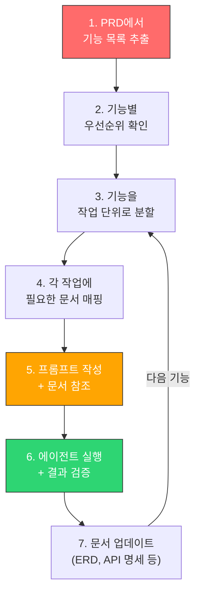
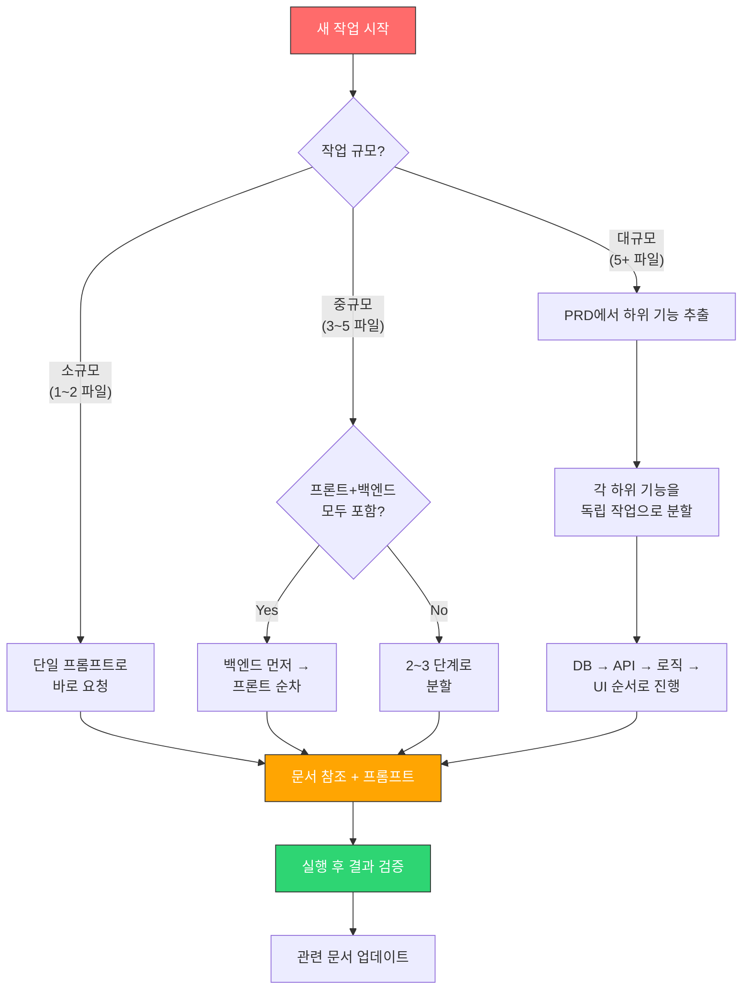

# 06. 바이브코딩 작업 요청 패턴

[← 목차로 돌아가기](./00-index.md) | [← 이전: 05. 기술스택별 전략](./05-tech-stack-strategies.md)

---

### 핵심 요약

```
효과적인 바이브코딩 = 좋은 문서 + 좋은 프롬프트 구조 + 적절한 작업 분할
이 장에서는:
① 작업 유형별 프롬프트 패턴 (Feature, Bugfix, 리팩토링, DB 변경, UI)
② 안티패턴과 올바른 패턴 비교
③ 문서 → 프롬프트 → 코드 생성 워크플로우
를 다룬다.
```

---

## 6.1 작업 유형별 요청 패턴

### ① 새 기능 개발 (Feature)

**넘길 문서**: PRD (해당 기능) + 아키텍처 + ERD  
**핵심**: 기능의 범위를 명확히 하고, 기존 패턴을 따르도록 지시

#### 효과적인 프롬프트

```
docs/PRD.md의 P0-3 '상품 검색' 기능을 구현해줘.

## 컨텍스트
- docs/architecture.md의 레이어 구조를 따라줘
- docs/erd.md의 PRODUCT, CATEGORY 테이블을 사용해
- 기존 코드 패턴: src/services/user_service.py를 참고해서 동일 패턴으로

## 구현 범위
1. Backend: GET /api/products/search 엔드포인트
   - 쿼리 파라미터: keyword, category_id, min_price, max_price, page, size
   - 페이지네이션 포함
2. Frontend: SearchPage 컴포넌트
   - 검색바 + 필터 + 결과 목록 + 페이지네이션
   - 디바운싱 적용 (300ms)

## 완료 기준
- 키워드 검색 + 카테고리 필터 + 가격 범위 필터 동작
- 빈 결과 시 "검색 결과가 없습니다" 표시
```

#### 안티패턴

```
# ❌ 나쁜 예 — 컨텍스트 없이 막연한 요청
"상품 검색 기능 만들어줘"

# 왜 나쁜가?
# - 에이전트가 DB 스키마를 추측함
# - 기존 코드 패턴을 무시할 수 있음
# - 검색 범위(프론트? 백? 둘 다?)가 불명확
# - 완료 기준이 없어서 과도하게 구현하거나 부족하게 구현
```

---

### ② 버그 수정 (Bugfix)

**넘길 문서**: 보통 문서 없이 가능. 복잡한 버그는 아키텍처 참조  
**핵심**: 재현 단계, 기대 동작, 실제 동작을 명확히

#### 효과적인 프롬프트

```
## 버그 리포트
**재현 단계:**
1. /dashboard 페이지 접속
2. 날짜 필터에서 "최근 7일" 선택
3. 차트가 렌더링되지 않고 빈 화면 표시

**기대 동작:** 최근 7일 데이터가 차트에 표시
**실제 동작:** 빈 화면, 콘솔에 "Cannot read property 'map' of undefined" 에러

**관련 파일:**
- src/components/features/DashboardChart.tsx (차트 컴포넌트)
- src/hooks/useDashboardData.ts (데이터 페칭)

원인을 분석하고 수정해줘.
수정 후 동일 시나리오에서 정상 동작하는지 확인할 수 있도록 
테스트 코드도 추가해줘.
```

#### 안티패턴

```
# ❌ 나쁜 예
"대시보드가 안 돼. 고쳐줘."

# 왜 나쁜가?
# - "안 돼"가 무슨 뜻인지 불명확 (로딩 안됨? 데이터 안나옴? 에러?)
# - 관련 파일을 몰라서 전체 코드베이스를 탐색해야 함
# - 재현 조건이 없어서 수정 후 검증 불가
```

---

### ③ 리팩토링

**넘길 문서**: 아키텍처 문서 필수  
**핵심**: 현재 문제점과 원하는 최종 상태를 명시

#### 효과적인 프롬프트

```
## 리팩토링 요청

### 현재 문제
src/services/order_service.py가 800줄이 넘고,
주문 생성/결제/배송/알림 로직이 모두 하나의 파일에 있다.

### 목표 구조
docs/architecture.md의 레이어 구조를 따라서 분리:

1. src/services/order_service.py → 주문 생성/수정/조회
2. src/services/payment_service.py → 결제 처리
3. src/services/shipping_service.py → 배송 상태 관리
4. src/services/notification_service.py → 알림 발송

### 규칙
- 기존 API 엔드포인트의 시그니처는 변경하지 마
- 기존 테스트가 모두 통과해야 해
- 각 서비스 간 의존성은 DI로 주입
```

#### 아키텍처 문서 유무에 따른 결과 차이

| | 아키텍처 문서 있음 | 아키텍처 문서 없음 |
|---|---|---|
| **파일 분리 기준** | 문서의 레이어에 맞춰 분리 | 에이전트가 임의로 분리 |
| **네이밍 컨벤션** | 기존 패턴과 일관됨 | 새로운 패턴이 섞일 수 있음 |
| **의존성 방향** | 문서에 정의된 방향 준수 | 양방향 의존이 생길 수 있음 |
| **결과 예측 가능성** | 높음 | 낮음 — 리뷰 시간 증가 |

---

### ④ DB 스키마 변경

**넘길 문서**: ERD 필수  
**핵심**: 변경 전/후 스키마를 명확히, 마이그레이션 전략 포함

#### 효과적인 프롬프트

```
## DB 스키마 변경 요청

### 배경
주문에 쿠폰 할인 기능을 추가해야 한다.

### 현재 ERD
docs/erd.md 참조

### 변경 내용
1. 새 테이블 추가: COUPON
   - id (PK), code (UK), discount_type (enum: "percent" | "fixed"), 
     discount_value (decimal), min_order_amount (decimal),
     valid_from (datetime), valid_until (datetime), is_active (boolean)

2. ORDER 테이블에 필드 추가:
   - coupon_id (FK, nullable) → COUPON
   - discount_amount (decimal, default 0)

### 요청 사항
1. Alembic 마이그레이션 스크립트 생성
2. SQLAlchemy 모델 업데이트 (models/coupon.py 신규, models/order.py 수정)
3. Pydantic 스키마 업데이트
4. docs/erd.md도 변경사항 반영해서 업데이트해줘
```

#### ERD 유무에 따른 차이

| | ERD 있음 | ERD 없음 |
|---|---|---|
| **기존 테이블 파악** | 즉시 파악, 관계 정확 | 코드를 탐색해야 함, 시간 소요 |
| **FK 관계 설정** | ERD 기반으로 정확한 관계 | 누락 또는 잘못된 관계 가능 |
| **인덱스 추가** | 기존 인덱스 전략과 일관됨 | 인덱스 누락 가능 |
| **마이그레이션 품질** | 높음 | 보통 — 수동 검토 필요 |

---

### ⑤ UI 구현

**넘길 문서**: 화면 설계서 (텍스트 와이어프레임이 가장 효과적)  
**핵심**: 레이아웃 구조, 컴포넌트 계층, 인터랙션을 텍스트로 설명

#### 효과적인 프롬프트

```
## UI 구현 요청

### 화면: 주문 상세 페이지

### 레이아웃 (위에서 아래로)
1. **헤더 영역**
   - 뒤로가기 버튼 | "주문 상세" 타이틀 | 주문번호 (#ORD-2024-001)

2. **주문 상태 트래커**
   - 수평 스텝 인디케이터: 주문접수 → 결제완료 → 배송중 → 배송완료
   - 현재 상태에 하이라이트

3. **주문 상품 목록** (카드 리스트)
   - 각 카드: [상품 이미지 64x64] [상품명 / 옵션] [수량 x 단가 = 소계]

4. **결제 정보** (카드)
   - 상품 합계: ₩xx,xxx
   - 배송비: ₩x,xxx  
   - 쿠폰 할인: -₩x,xxx
   - **총 결제금액: ₩xx,xxx** (볼드)

5. **배송 정보** (카드)
   - 수령인, 연락처, 배송지 주소

### 기술 지시
- 기존 UI 컴포넌트: src/components/ui/ 의 Card, Badge, Stepper 사용
- 데이터 페칭: React Query의 useQuery 사용
- API: GET /api/orders/{orderId}
- 스타일: TailwindCSS
```

#### 화면 설계서 포맷별 에이전트 이해도

| 포맷 | 에이전트 이해도 | 설명 |
|------|:---:|------|
| **텍스트 와이어프레임** (위 예시처럼) | ★★★★★ | 레이아웃 구조와 데이터를 정확히 파악 |
| **ASCII art** | ★★★★☆ | 시각적 구조 파악 가능, 복잡하면 해석 어려움 |
| **Markdown 표** | ★★★☆☆ | 간단한 레이아웃에 적합 |
| **Figma/Sketch 이미지** | ★★☆☆☆ | 전체적 느낌은 파악 가능, 세부사항 누락 |
| **구두 설명** ("이쁘게 만들어줘") | ★☆☆☆☆ | 에이전트가 100% 추측으로 구현 |

---

## 6.2 프롬프트 구조 템플릿

### 범용 프롬프트 템플릿

모든 작업 유형에 적용 가능한 기본 구조:

```
## [작업 유형] — [작업 제목]

### 배경/목적
[왜 이 작업이 필요한가 — 1~2문장]

### 참조 문서
- [문서 경로와 참조할 섹션]

### 구현 범위
1. [구체적 작업 1]
2. [구체적 작업 2]
3. ...

### 기술 지시
- [패턴, 컨벤션, 사용할 라이브러리]
- [참고할 기존 코드]

### 완료 기준
- [검증 가능한 기준 1]
- [검증 가능한 기준 2]

### 제약사항 (있다면)
- [하지 말아야 할 것]
- [호환성 요구사항]
```

### 작업 규모별 프롬프트 전략

| 규모 | 예시 | 프롬프트 전략 |
|------|------|-------------|
| **소규모** (1~2 파일) | 버그 수정, 함수 추가 | 단일 프롬프트로 충분 |
| **중규모** (3~5 파일) | 새 API + 화면 | 백엔드/프론트엔드 분리하여 순차 요청 |
| **대규모** (5+ 파일) | 새 도메인 모듈 | 작업을 3~4단계로 분할하여 순차 진행 |

---

## 6.3 문서 → 프롬프트 연결 워크플로우

### 전체 흐름



### 구체적 예시: "쇼핑몰 주문 기능" 구현

#### Step 1: PRD에서 기능 추출

PRD의 P0 기능 중 "주문 처리"를 선택:
```
P0-4: 주문 처리
- 장바구니 → 주문서 작성 → 결제 → 주문 완료
- 주문 상태 조회
- 주문 취소
```

#### Step 2: 작업 분할

```
주문 기능을 아래 순서로 분할:

작업 1: DB 스키마 (ORDER, ORDER_ITEM 테이블)
작업 2: 백엔드 API (주문 CRUD)
작업 3: 주문 비즈니스 로직 (상태 전이, 재고 차감)
작업 4: 프론트엔드 (주문서 작성 화면)
작업 5: 프론트엔드 (주문 상태 조회 화면)
```

#### Step 3: 작업별 프롬프트 + 문서 매핑

**작업 1 — DB 스키마:**
```
docs/erd.md를 참고해서 ORDER, ORDER_ITEM 테이블의
SQLAlchemy 모델과 Alembic 마이그레이션을 생성해줘.

ORDER.status는 enum으로: pending → paid → shipped → delivered → cancelled
erd.md에 정의된 인덱스 전략을 적용해줘.

완료 후 docs/erd.md에 새 테이블 정보를 반영해줘.
```

**작업 2 — 백엔드 API:**
```
작업 1에서 만든 모델을 기반으로 주문 API를 구현해줘.

docs/architecture.md의 레이어 구조를 따라:
- routers/order_router.py (엔드포인트)
- services/order_service.py (비즈니스 로직)
- schemas/order_schema.py (Pydantic 스키마)

엔드포인트:
- POST /api/orders — 주문 생성
- GET /api/orders/{id} — 주문 상세 조회
- GET /api/orders — 내 주문 목록 (페이지네이션)
- PATCH /api/orders/{id}/cancel — 주문 취소

기존 코드 패턴은 routers/user_router.py를 참고해줘.
```

**작업 3 — 비즈니스 로직:**
```
order_service.py에 다음 비즈니스 규칙을 추가해줘:

1. 주문 생성 시: 재고 확인 → 재고 차감 → 주문 생성 (트랜잭션)
2. 주문 취소 시: status가 pending/paid인 경우만 가능 → 재고 복구
3. 결제 완료 시: status를 paid로 변경

docs/erd.md의 PRODUCT.stock 필드와 ORDER.status 상태 전이 규칙을 참조해줘.
```

**작업 4~5 — 프론트엔드:**
```
작업 2에서 만든 API를 기반으로 주문서 작성 화면을 구현해줘.

레이아웃:
1. 주문 상품 목록 (장바구니에서 가져온 상품들)
2. 배송지 입력 폼 (수령인, 연락처, 주소)
3. 결제 수단 선택 (현재는 가상계좌만)
4. 주문 요약 + "주문하기" 버튼

기존 UI 컴포넌트(src/components/ui/)를 활용해줘.
데이터 페칭은 React Query의 useMutation 사용.
```

---

## 6.4 에이전트 요청 시 핵심 원칙

### DO (이렇게 하라)

| 원칙 | 예시 |
|------|------|
| **문서를 먼저 참조시켜라** | "docs/erd.md를 읽고..." |
| **범위를 명확히 하라** | "이 작업에서는 백엔드 API만 구현해줘. 프론트는 다음에." |
| **기존 패턴을 참고시켜라** | "src/services/user_service.py와 같은 패턴으로" |
| **완료 기준을 명시하라** | "로그인 후 대시보드에서 주문 내역이 보이면 완료" |
| **작업을 분할하라** | 대규모 기능은 3~5개 작업으로 나눠서 순차 요청 |

### DON'T (이렇게 하지 마라)

| 안티패턴 | 왜 나쁜가 | 개선 |
|---------|----------|------|
| "이거 만들어줘" | 범위, 기술, 패턴 모두 불명확 | 구현 범위 + 기술 지시 추가 |
| "전부 다 한번에 해줘" | 대규모 작업은 품질 저하 | 3~5개로 분할 |
| 문서 참조 없이 요청 | 에이전트가 DB 구조, 패턴을 추측 | 관련 문서 경로 명시 |
| 완료 기준 없음 | 과도 구현 or 부족 구현 | 검증 가능한 완료 기준 |
| "예쁘게/깔끔하게" | 주관적 기준, 에이전트가 해석 불가 | 구체적 UI 명세 또는 참조 컴포넌트 |

---

## 6.5 문서 기반 작업 분할 의사결정 트리



---

## 6.6 세션 관리 전략

### 긴 개발 세션 (여러 기능 연속 구현)

```
세션 시작 시:
1. CLAUDE.md 자동 로드 (자동)
2. "오늘 작업할 기능: PRD.md의 P0-3, P0-4, P0-5"로 컨텍스트 설정
3. 각 기능별로 순차 진행

세션 중:
- 기능 완료 시마다 "문서도 업데이트해줘" 요청
- 큰 변경이 있으면 커밋 후 다음 작업 진행

세션 종료 시:
- "오늘 변경된 내용을 기반으로 CLAUDE.md를 업데이트해줘"
- 변경 사항 커밋
```

### 새 세션 시작 시 (이전 세션 이어가기)

```
"어제 세션에서 PRD의 P0-3까지 완료했어.
오늘은 P0-4 '주문 처리' 기능부터 시작할 거야.
docs/ 폴더의 문서들을 읽고 현재 프로젝트 상태를 파악해줘."
```

---

[← 목차로 돌아가기](./00-index.md)
