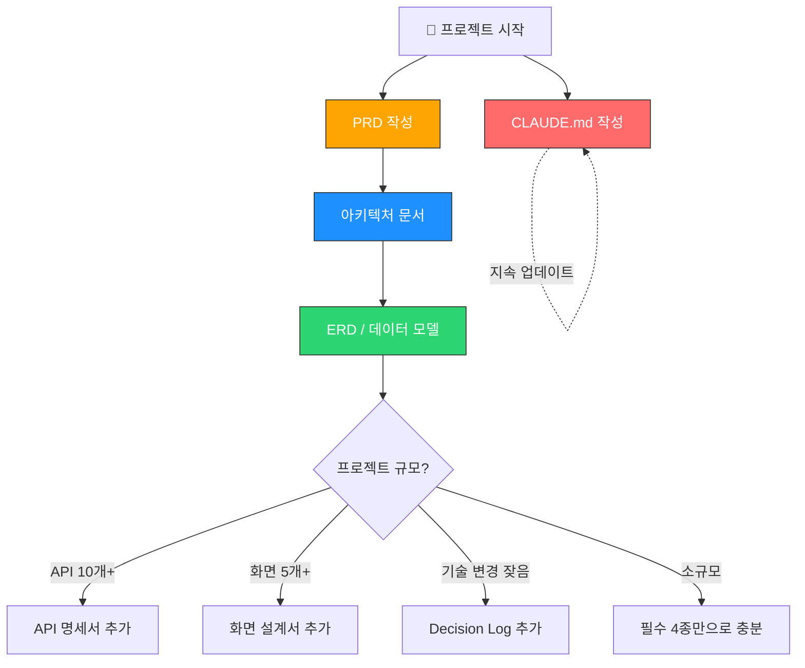

# 1인 바이브코딩 개발자를 위한 개발 문서 체계 가이드

> **대상**: Claude Code를 주력으로 사용하는 1인 개발자  
> **목적**: 사람이 읽고 + 코딩 에이전트에게 컨텍스트로 제공하는 실전 문서 체계  
> **원칙**: 최소 문서, 최대 효과 — 오버스펙 금지

---

## 목차

1. [개발 문서 종류 정리](#1-개발-문서-종류-정리)
2. [코딩 에이전트 친화적 문서 포맷](#2-코딩-에이전트-친화적-문서-포맷)
3. [각 문서의 실전 작성 가이드](#3-각-문서의-실전-작성-가이드)
4. [문서 작성 생산성 도구](#4-문서-작성-생산성-도구)
5. [기술스택별 문서 작성 전략 & 바이브코딩 작업 요청 패턴](#5-기술스택별-문서-작성-전략--바이브코딩-작업-요청-패턴)

---

## 1. 개발 문서 종류 정리

### 핵심 요약

```
필수 (4종) → 이것 없이는 바이브코딩 품질이 급락
권장 (3종) → 프로젝트가 커지면 추가
불필요 (5종) → 1인 개발에서는 시간 낭비
```

### 1.1 필수 문서 (Must Have)

#### ① CLAUDE.md (프로젝트 컨텍스트 파일)

| 항목 | 내용 |
|------|------|
| **목적** | 코딩 에이전트가 프로젝트를 이해하는 "첫 번째 진입점". 기술스택, 컨벤션, 프로젝트 구조를 한곳에 정리 |
| **작성 시점** | 프로젝트 시작 시 작성, 이후 지속 업데이트 |
| **분량 가이드** | A4 1~3페이지 (너무 길면 에이전트가 핵심을 놓침) |
| **에이전트 활용도** | ★★★★★ — Claude Code가 자동으로 읽는 파일. 가장 ROI가 높은 문서 |

> **왜 필수인가?** Claude Code는 세션 시작 시 CLAUDE.md를 자동으로 읽는다. 이 파일이 없으면 매 세션마다 프로젝트 설명을 반복해야 한다. 바이브코딩의 효율은 이 파일의 품질에 비례한다.

#### ② PRD (Product Requirements Document) — 경량 버전

| 항목 | 내용 |
|------|------|
| **목적** | "무엇을 만드는가"를 정의. 기능 목록, 우선순위, 핵심 유저 시나리오를 담는다 |
| **작성 시점** | 개발 전 (코드 작성 전에 반드시) |
| **분량 가이드** | A4 2~5페이지 (기능 목록 + 우선순위면 충분) |
| **에이전트 활용도** | ★★★★☆ — 새 기능 개발 시 에이전트에게 넘기면 구현 방향을 잡아줌 |

> **왜 필수인가?** PRD 없이 바이브코딩하면 "일단 만들고 고치기"의 무한루프에 빠진다. 에이전트에게 명확한 요구사항을 주지 않으면, 에이전트도 추측으로 코드를 짠다.

#### ③ 아키텍처 문서 (Architecture Overview)

| 항목 | 내용 |
|------|------|
| **목적** | 시스템의 전체 구조, 레이어 분리, 주요 컴포넌트 간 관계를 시각화 |
| **작성 시점** | 개발 전~초기 (기술 선택 후, 본격 코딩 전) |
| **분량 가이드** | A4 1~3페이지 + Mermaid 다이어그램 1~2개 |
| **에이전트 활용도** | ★★★★★ — 리팩토링, 새 모듈 추가 시 에이전트가 기존 구조를 파악하는 핵심 자료 |

> **왜 필수인가?** 아키텍처 문서 없이 에이전트에게 리팩토링을 맡기면, 기존 패턴을 무시한 코드가 나온다. "이 프로젝트는 MVVM 패턴이고, ViewModel은 이 폴더에 있다"는 정보가 결과 품질을 결정한다.

#### ④ 데이터 모델/ERD 문서

| 항목 | 내용 |
|------|------|
| **목적** | DB 스키마, 엔티티 관계, 핵심 데이터 흐름을 정의 |
| **작성 시점** | 개발 전~초기 (DB 설계 시) |
| **분량 가이드** | A4 1~2페이지 + Mermaid ERD |
| **에이전트 활용도** | ★★★★★ — DB 관련 작업(쿼리 작성, 마이그레이션, CRUD) 시 필수 컨텍스트 |

> **왜 필수인가?** 에이전트에게 "사용자 목록 API 만들어줘"라고 할 때, ERD가 있으면 정확한 JOIN과 필드를 포함한 코드가 나온다. 없으면 테이블 구조를 추측한다.

---

### 1.2 권장 문서 (Nice to Have)

#### ⑤ API 명세서

| 항목 | 내용 |
|------|------|
| **목적** | REST/GraphQL 엔드포인트, 요청/응답 포맷, 인증 방식 정리 |
| **작성 시점** | 개발 중 (API 구현과 동시에) |
| **분량 가이드** | 엔드포인트 수에 비례 (엔드포인트당 10~20줄) |
| **에이전트 활용도** | ★★★★☆ — 프론트엔드 구현 시 API 호출 코드를 정확하게 생성 |

> **언제 추가?** 백엔드 API가 10개 이상이거나, 프론트/백 분리 구조일 때.

#### ⑥ 화면 설계서 (UI Wireframe)

| 항목 | 내용 |
|------|------|
| **목적** | 주요 화면의 레이아웃, 컴포넌트 배치, 네비게이션 흐름 |
| **작성 시점** | 개발 전~초기 |
| **분량 가이드** | 화면당 1페이지 (텍스트 와이어프레임 또는 ASCII art) |
| **에이전트 활용도** | ★★★☆☆ — 텍스트 기반 와이어프레임은 이해 가능, 이미지는 제한적 |

> **언제 추가?** 화면이 5개 이상이거나, 복잡한 대시보드/폼이 있을 때.

#### ⑦ 변경 이력 / Decision Log

| 항목 | 내용 |
|------|------|
| **목적** | "왜 이 기술을 선택했는가", "왜 이 구조로 바꿨는가"를 기록 |
| **작성 시점** | 개발 중 (중요 결정 시마다) |
| **분량 가이드** | 결정 건당 3~5줄 |
| **에이전트 활용도** | ★★★☆☆ — 에이전트가 "왜?"를 물을 때 참조 가능 |

> **언제 추가?** 기술 선택을 자주 바꾸거나, 3개월 뒤 "왜 이렇게 했지?" 싶을 때.

---

### 1.3 불필요 문서 (Overkill)

| 문서 | 불필요 이유 |
|------|-------------|
| **상세 기능 명세서 (SRS)** | 엔터프라이즈용. 1인 개발에서는 PRD의 기능 목록이면 충분. 상세 명세 작성 시간 > 직접 구현 시간 |
| **테스트 계획서** | 테스트 코드 자체가 문서 역할. 별도 계획서는 유지보수 부담만 증가 |
| **배포 가이드** | CI/CD 파이프라인 코드(GitHub Actions 등)가 문서 역할. 별도 문서는 금방 outdated |
| **회의록 / 커뮤니케이션 기록** | 1인 개발이므로 커뮤니케이션 대상이 없음. Decision Log로 대체 |
| **리스크 관리 문서** | PM이 관리하는 문서. 1인 개발자는 TODO/이슈 트래커로 충분 |

---

### 1.4 문서 체계 전체 구조



### 1.5 문서 작성 타이밍 요약

```mermaid
gantt
    title 문서 작성 타이밍
    dateFormat X
    axisFormat %s
    
    section 필수 문서
    CLAUDE.md           :active, 0, 100
    PRD                 :crit, 0, 20
    아키텍처 문서        :crit, 10, 30
    ERD                 :crit, 15, 35
    
    section 권장 문서
    API 명세서          :30, 80
    화면 설계서          :10, 30
    Decision Log        :20, 100
```



> 가로축: 프로젝트 진행률 (0% ~ 100%)  
> CLAUDE.md는 프로젝트 전 기간에 걸쳐 업데이트. PRD/아키텍처/ERD는 초기에 집중.
