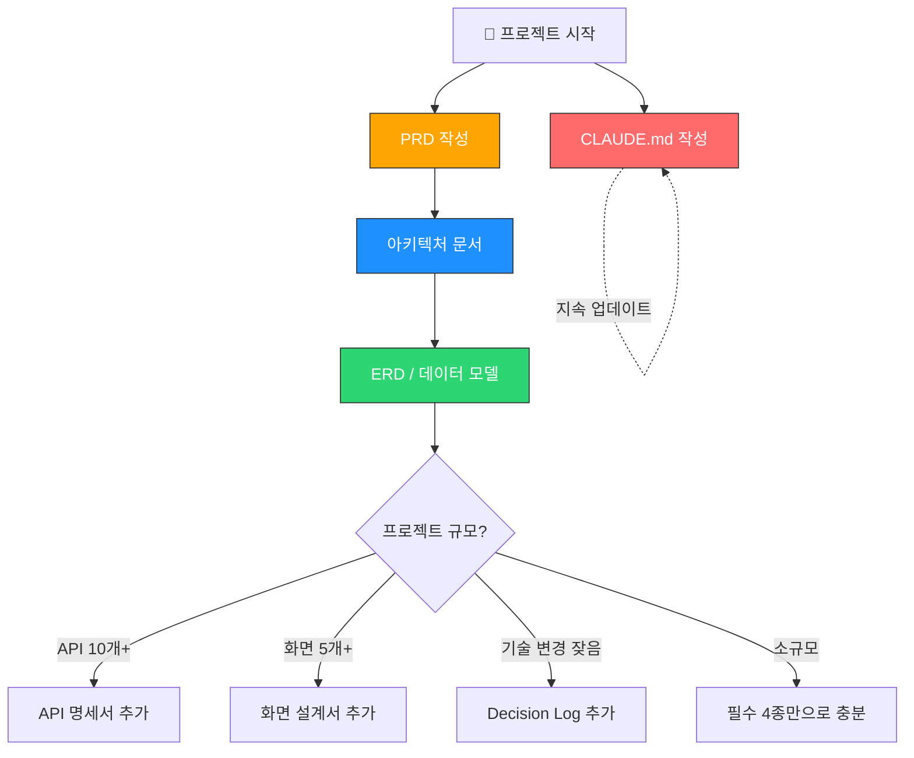
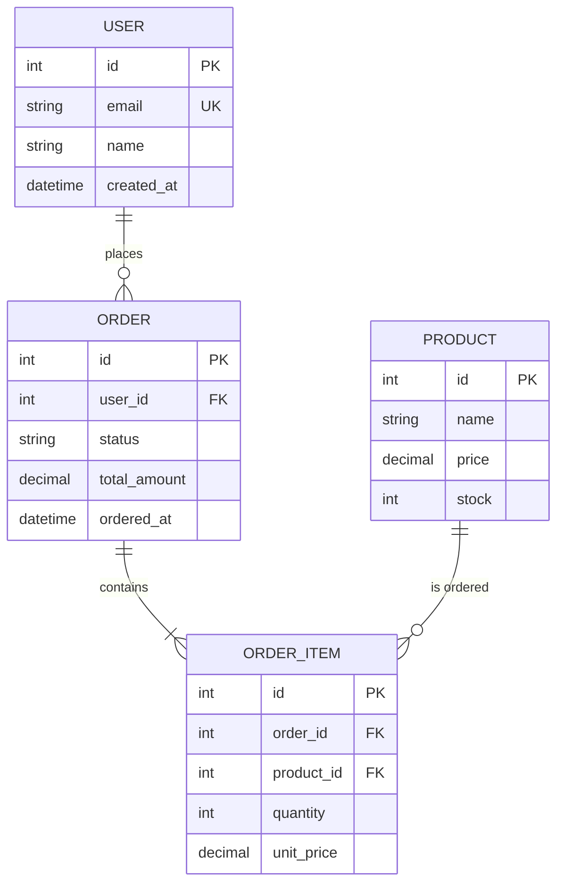
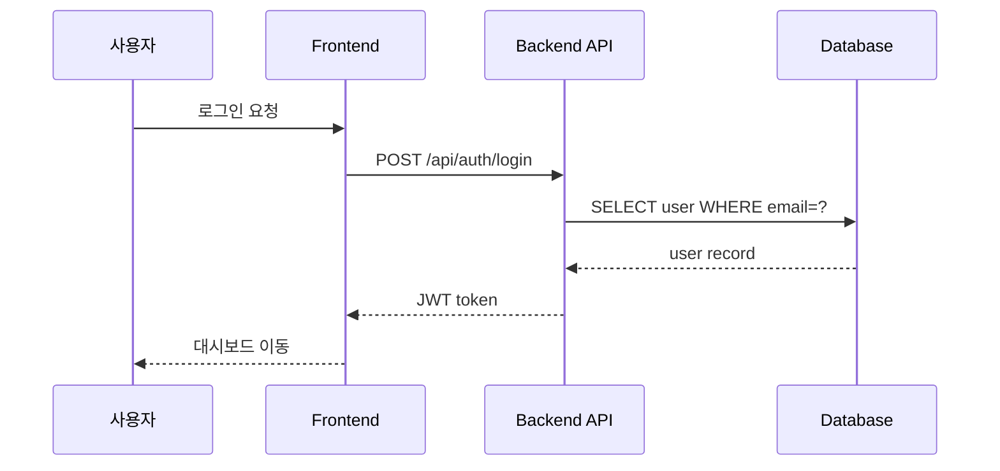
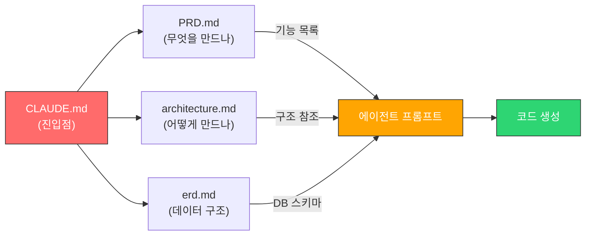

# 1인 바이브코딩 개발자를 위한 개발 문서 체계 가이드

> **대상**: Claude Code를 주력으로 사용하는 1인 개발자  
> **목적**: 사람이 읽고 + 코딩 에이전트에게 컨텍스트로 제공하는 실전 문서 체계  
> **원칙**: 최소 문서, 최대 효과 — 오버스펙 금지

---

## 목차

1. [개발 문서 종류 정리](#1-개발-문서-종류-정리)
2. [코딩 에이전트 친화적 문서 포맷](#2-코딩-에이전트-친화적-문서-포맷)
3. [각 문서의 실전 작성 가이드](#3-각-문서의-실전-작성-가이드)
4. [문서 작성 생산성 도구](#4-문서-작성-생산성-도구)
5. [기술스택별 문서 작성 전략 & 바이브코딩 작업 요청 패턴](#5-기술스택별-문서-작성-전략--바이브코딩-작업-요청-패턴)

---

## 1. 개발 문서 종류 정리

### 핵심 요약

```
필수 (4종) → 이것 없이는 바이브코딩 품질이 급락
권장 (3종) → 프로젝트가 커지면 추가
불필요 (5종) → 1인 개발에서는 시간 낭비
```

### 1.1 필수 문서 (Must Have)

#### ① CLAUDE.md (프로젝트 컨텍스트 파일)

| 항목 | 내용 |
|------|------|
| **목적** | 코딩 에이전트가 프로젝트를 이해하는 "첫 번째 진입점". 기술스택, 컨벤션, 프로젝트 구조를 한곳에 정리 |
| **작성 시점** | 프로젝트 시작 시 작성, 이후 지속 업데이트 |
| **분량 가이드** | A4 1~3페이지 (너무 길면 에이전트가 핵심을 놓침) |
| **에이전트 활용도** | ★★★★★ — Claude Code가 자동으로 읽는 파일. 가장 ROI가 높은 문서 |

> **왜 필수인가?** Claude Code는 세션 시작 시 CLAUDE.md를 자동으로 읽는다. 이 파일이 없으면 매 세션마다 프로젝트 설명을 반복해야 한다. 바이브코딩의 효율은 이 파일의 품질에 비례한다.

#### ② PRD (Product Requirements Document) — 경량 버전

| 항목 | 내용 |
|------|------|
| **목적** | "무엇을 만드는가"를 정의. 기능 목록, 우선순위, 핵심 유저 시나리오를 담는다 |
| **작성 시점** | 개발 전 (코드 작성 전에 반드시) |
| **분량 가이드** | A4 2~5페이지 (기능 목록 + 우선순위면 충분) |
| **에이전트 활용도** | ★★★★☆ — 새 기능 개발 시 에이전트에게 넘기면 구현 방향을 잡아줌 |

> **왜 필수인가?** PRD 없이 바이브코딩하면 "일단 만들고 고치기"의 무한루프에 빠진다. 에이전트에게 명확한 요구사항을 주지 않으면, 에이전트도 추측으로 코드를 짠다.

#### ③ 아키텍처 문서 (Architecture Overview)

| 항목 | 내용 |
|------|------|
| **목적** | 시스템의 전체 구조, 레이어 분리, 주요 컴포넌트 간 관계를 시각화 |
| **작성 시점** | 개발 전~초기 (기술 선택 후, 본격 코딩 전) |
| **분량 가이드** | A4 1~3페이지 + Mermaid 다이어그램 1~2개 |
| **에이전트 활용도** | ★★★★★ — 리팩토링, 새 모듈 추가 시 에이전트가 기존 구조를 파악하는 핵심 자료 |

> **왜 필수인가?** 아키텍처 문서 없이 에이전트에게 리팩토링을 맡기면, 기존 패턴을 무시한 코드가 나온다. "이 프로젝트는 MVVM 패턴이고, ViewModel은 이 폴더에 있다"는 정보가 결과 품질을 결정한다.

#### ④ 데이터 모델/ERD 문서

| 항목 | 내용 |
|------|------|
| **목적** | DB 스키마, 엔티티 관계, 핵심 데이터 흐름을 정의 |
| **작성 시점** | 개발 전~초기 (DB 설계 시) |
| **분량 가이드** | A4 1~2페이지 + Mermaid ERD |
| **에이전트 활용도** | ★★★★★ — DB 관련 작업(쿼리 작성, 마이그레이션, CRUD) 시 필수 컨텍스트 |

> **왜 필수인가?** 에이전트에게 "사용자 목록 API 만들어줘"라고 할 때, ERD가 있으면 정확한 JOIN과 필드를 포함한 코드가 나온다. 없으면 테이블 구조를 추측한다.

---

### 1.2 권장 문서 (Nice to Have)

#### ⑤ API 명세서

| 항목 | 내용 |
|------|------|
| **목적** | REST/GraphQL 엔드포인트, 요청/응답 포맷, 인증 방식 정리 |
| **작성 시점** | 개발 중 (API 구현과 동시에) |
| **분량 가이드** | 엔드포인트 수에 비례 (엔드포인트당 10~20줄) |
| **에이전트 활용도** | ★★★★☆ — 프론트엔드 구현 시 API 호출 코드를 정확하게 생성 |

> **언제 추가?** 백엔드 API가 10개 이상이거나, 프론트/백 분리 구조일 때.

#### ⑥ 화면 설계서 (UI Wireframe)

| 항목 | 내용 |
|------|------|
| **목적** | 주요 화면의 레이아웃, 컴포넌트 배치, 네비게이션 흐름 |
| **작성 시점** | 개발 전~초기 |
| **분량 가이드** | 화면당 1페이지 (텍스트 와이어프레임 또는 ASCII art) |
| **에이전트 활용도** | ★★★☆☆ — 텍스트 기반 와이어프레임은 이해 가능, 이미지는 제한적 |

> **언제 추가?** 화면이 5개 이상이거나, 복잡한 대시보드/폼이 있을 때.

#### ⑦ 변경 이력 / Decision Log

| 항목 | 내용 |
|------|------|
| **목적** | "왜 이 기술을 선택했는가", "왜 이 구조로 바꿨는가"를 기록 |
| **작성 시점** | 개발 중 (중요 결정 시마다) |
| **분량 가이드** | 결정 건당 3~5줄 |
| **에이전트 활용도** | ★★★☆☆ — 에이전트가 "왜?"를 물을 때 참조 가능 |

> **언제 추가?** 기술 선택을 자주 바꾸거나, 3개월 뒤 "왜 이렇게 했지?" 싶을 때.

---

### 1.3 불필요 문서 (Overkill)

| 문서 | 불필요 이유 |
|------|-------------|
| **상세 기능 명세서 (SRS)** | 엔터프라이즈용. 1인 개발에서는 PRD의 기능 목록이면 충분. 상세 명세 작성 시간 > 직접 구현 시간 |
| **테스트 계획서** | 테스트 코드 자체가 문서 역할. 별도 계획서는 유지보수 부담만 증가 |
| **배포 가이드** | CI/CD 파이프라인 코드(GitHub Actions 등)가 문서 역할. 별도 문서는 금방 outdated |
| **회의록 / 커뮤니케이션 기록** | 1인 개발이므로 커뮤니케이션 대상이 없음. Decision Log로 대체 |
| **리스크 관리 문서** | PM이 관리하는 문서. 1인 개발자는 TODO/이슈 트래커로 충분 |

---

### 1.4 문서 체계 전체 구조



### 1.5 문서 작성 타이밍 요약

```mermaid
gantt
    title 문서 작성 타이밍
    dateFormat X
    axisFormat %s
    
    section 필수 문서
    CLAUDE.md           :active, 0, 100
    PRD                 :crit, 0, 20
    아키텍처 문서        :crit, 10, 30
    ERD                 :crit, 15, 35
    
    section 권장 문서
    API 명세서          :30, 80
    화면 설계서          :10, 30
    Decision Log        :20, 100
```



> 가로축: 프로젝트 진행률 (0% ~ 100%)  
> CLAUDE.md는 프로젝트 전 기간에 걸쳐 업데이트. PRD/아키텍처/ERD는 초기에 집중.

---

## 2. 코딩 에이전트 친화적 문서 포맷

### 핵심 요약

```
1순위: Markdown + Mermaid → 에이전트가 완벽히 이해, Git 친화적
2순위: PlantUML → 에이전트 이해 가능, 문법이 다소 장황
3순위: draw.io XML → 에이전트가 부분적으로 이해, 사람에겐 시각적으로 우수
비추: 이미지(PNG/JPG) 기반 문서 → 에이전트가 읽을 수 없음
```

### 2.1 포맷별 상세 비교

| 비교 기준 | **Markdown** | **Mermaid** | **PlantUML** | **draw.io** | **Eraser.io** |
|-----------|:---:|:---:|:---:|:---:|:---:|
| 에이전트 파싱/이해 | ★★★★★ | ★★★★★ | ★★★★☆ | ★★☆☆☆ | ★★☆☆☆ |
| 작성 난이도 | 매우 쉬움 | 쉬움 | 보통 | 쉬움(GUI) | 쉬움(GUI) |
| 학습 곡선 | 거의 없음 | 30분 | 1~2시간 | 거의 없음 | 거의 없음 |
| Git 친화성 | ★★★★★ | ★★★★★ | ★★★★★ | ★★★☆☆ | ★☆☆☆☆ |
| 에이전트 생성 가능 | ✅ 직접 작성 | ✅ 직접 생성 | ✅ 직접 생성 | ❌ 불가 | ❌ 불가 |
| 렌더링 환경 | 어디서든 | GitHub, VS Code | 플러그인 필요 | 전용 에디터 | 웹 전용 |

### 2.2 각 포맷의 장단점 상세

#### Markdown (순수 텍스트)

**장점:**
- 코딩 에이전트가 100% 파싱/이해/생성 가능
- 어떤 에디터에서든 편집 가능
- Git diff가 깔끔하게 보임
- CLAUDE.md, PRD, API 명세 등 거의 모든 문서에 적합

**단점:**
- 복잡한 관계(ERD, 시퀀스 다이어그램)를 텍스트만으로 표현하기 어려움
- 시각적 임팩트가 약함

**최적 용도:** PRD, CLAUDE.md, API 명세서, Decision Log, 기술 문서 전반

#### Mermaid (다이어그램 as code)

**장점:**
- Markdown 코드블록 안에 작성 → 하나의 .md 파일로 관리
- GitHub에서 자동 렌더링
- 에이전트가 Mermaid 코드를 읽고/생성/수정 가능
- ERD, 시퀀스, 플로우차트, 클래스 다이어그램 모두 지원

**단점:**
- 매우 복잡한 다이어그램은 가독성 저하
- 레이아웃 자동 배치라 미세 조정 불가

**최적 용도:** ERD, 아키텍처 다이어그램, 시퀀스 다이어그램, 상태 머신

**실제 예시 — ERD:**


**실제 예시 — 시퀀스 다이어그램:**


#### PlantUML

**장점:**
- Mermaid보다 표현력이 풍부 (복잡한 클래스 다이어그램에 유리)
- 에이전트가 문법을 이해하고 생성 가능

**단점:**
- Java 런타임 또는 서버 필요 (렌더링)
- GitHub에서 네이티브 렌더링 미지원
- Mermaid 대비 생태계가 좁아지는 추세

**최적 용도:** 복잡한 클래스 다이어그램, 대규모 시퀀스 다이어그램 (일반적으로 Mermaid로 충분)

#### draw.io / Eraser.io (GUI 다이어그램 도구)

**장점:**
- 시각적으로 아름다운 다이어그램
- 드래그 앤 드롭으로 빠른 작성
- draw.io는 XML 형태로 Git 저장 가능

**단점:**
- **코딩 에이전트가 내용을 파싱하기 매우 어려움** (XML/독자 포맷)
- draw.io XML의 Git diff는 사람이 읽기 어려움
- 에이전트에게 컨텍스트로 제공 불가능

**최적 용도:** 외부 발표/문서화용 (에이전트 협업이 아닌 사람 간 소통용)

### 2.3 문서 종류별 최적 포맷 매칭

| 문서 종류 | 1순위 포맷 | 2순위 포맷 | 비고 |
|-----------|-----------|-----------|------|
| **CLAUDE.md** | Markdown | — | 순수 텍스트 필수 |
| **PRD** | Markdown | — | 기능 목록, 우선순위 표 |
| **아키텍처 다이어그램** | Mermaid (flowchart) | PlantUML | 레이어 구조, 컴포넌트 관계 |
| **ERD** | Mermaid (erDiagram) | PlantUML | 엔티티 관계, 필드 정의 |
| **시퀀스 다이어그램** | Mermaid (sequence) | PlantUML | API 호출 흐름, 인증 플로우 |
| **API 명세서** | Markdown (표) | OpenAPI/YAML | 엔드포인트별 정리 |
| **화면 설계서** | Markdown (텍스트 와이어프레임) | Excalidraw | ASCII art 또는 텍스트 설명 |
| **상태 다이어그램** | Mermaid (stateDiagram) | PlantUML | 주문 상태, 워크플로우 |
| **Decision Log** | Markdown | — | 날짜 + 결정 + 이유 |

### 2.4 결론: 바이브코딩 최적 조합

```
📁 docs/
├── CLAUDE.md              ← Markdown (프로젝트 루트)
├── PRD.md                 ← Markdown
├── architecture.md        ← Markdown + Mermaid 다이어그램
├── erd.md                 ← Markdown + Mermaid erDiagram
├── api-spec.md            ← Markdown 표
└── decisions.md           ← Markdown
```

> **원칙: "Markdown + Mermaid" 조합이면 1인 바이브코딩의 모든 문서를 커버할 수 있다.**  
> 에이전트가 읽고, 생성하고, 수정할 수 있으며, Git으로 버전 관리되고, GitHub에서 렌더링된다.

---

## 3. 각 문서의 실전 작성 가이드

### 핵심 요약

```
각 필수 문서에 대해:
① 복붙 가능한 템플릿
② 작성 팁 & 안티패턴
③ 에이전트에게 전달하는 방법
을 제공한다.
```

---

### 3.1 CLAUDE.md — 프로젝트 컨텍스트 파일

#### 템플릿

```markdown
# 프로젝트명

## 개요
[한 문장으로 프로젝트 설명]

## 기술 스택
- **언어**: 
- **프레임워크**: 
- **DB**: 
- **주요 라이브러리**: 

## 프로젝트 구조
```
src/
├── models/          # 데이터 모델
├── views/           # UI 컴포넌트
├── controllers/     # 비즈니스 로직
├── services/        # 외부 API 연동
└── utils/           # 유틸리티 함수
```

## 코딩 컨벤션
- [네이밍 규칙, 패턴, 주의사항 등]
- [예: "함수명은 camelCase, 클래스는 PascalCase"]
- [예: "에러 처리는 Result 패턴 사용"]

## 빌드 & 실행
- **빌드**: `npm run build`
- **개발**: `npm run dev`
- **테스트**: `npm test`

## 현재 상태
- [진행 중인 작업 또는 알려진 이슈]

## 주의사항
- [에이전트가 코드 생성 시 반드시 지켜야 할 규칙]
- [예: "절대 any 타입 사용 금지"]
- [예: "DB 직접 접근 금지, 반드시 Repository 패턴 사용"]
```

#### 작성 팁

- **구체적으로 쓰라**: "깔끔한 코드 작성" → ❌ | "함수당 20줄 이내, 파라미터 3개 이내" → ✅
- **금지 사항을 명시하라**: 에이전트가 하지 말아야 할 것을 적으면 실수가 줄어든다
- **프로젝트 구조는 실제 디렉토리와 일치시켜라**: 에이전트가 파일을 찾는 데 사용
- **지속 업데이트하라**: 새 패키지 추가, 구조 변경 시마다 반영

#### 안티패턴

| 안티패턴 | 왜 나쁜가 | 올바른 방법 |
|---------|----------|------------|
| 10페이지 이상 장문 | 에이전트가 핵심을 놓침 | 1~3페이지로 핵심만 |
| "좋은 코드를 작성하세요" 같은 모호한 지시 | 에이전트가 해석을 못함 | 구체적 규칙과 예시 |
| 프로젝트 구조가 실제와 다름 | 에이전트가 없는 파일을 참조 | 실제 구조와 동기화 |
| 한 번 작성 후 방치 | 구조가 변하면 오히려 혼란 | 주기적 업데이트 |

#### 에이전트에게 전달하는 방법

CLAUDE.md는 **프로젝트 루트에 두면 자동으로 로드**된다. 별도 전달 불필요.

```
프로젝트 루트/
├── CLAUDE.md          ← Claude Code가 자동 인식
├── src/
├── package.json
└── ...
```

하위 디렉토리에도 CLAUDE.md를 둘 수 있다 (해당 디렉토리 작업 시 추가 컨텍스트):
```
src/
├── CLAUDE.md          ← src/ 하위 작업 시 추가 로드
├── components/
│   └── CLAUDE.md      ← 컴포넌트 관련 작업 시 추가 로드
└── ...
```

---

### 3.2 PRD (경량 Product Requirements Document)

#### 템플릿

```markdown
# [프로젝트명] PRD

## 1. 프로젝트 목적
[이 프로젝트가 해결하는 문제를 2~3문장으로]

## 2. 대상 사용자
- [주요 사용자 그룹 1]: [특성]
- [주요 사용자 그룹 2]: [특성]

## 3. 핵심 기능 목록

### P0 (필수 — MVP)
| # | 기능명 | 설명 | 완료 기준 |
|---|--------|------|----------|
| 1 | 사용자 인증 | 이메일/비밀번호 로그인, 회원가입 | 로그인 후 대시보드 접근 가능 |
| 2 | 대시보드 | 주요 지표 요약 표시 | 매출, 주문수, 신규회원 표시 |
| 3 | ... | ... | ... |

### P1 (중요 — MVP 이후)
| # | 기능명 | 설명 | 완료 기준 |
|---|--------|------|----------|
| 4 | 알림 설정 | 이메일/푸시 알림 설정 | 알림 ON/OFF 토글 동작 |

### P2 (나중에)
| # | 기능명 | 설명 |
|---|--------|------|
| 5 | 다국어 지원 | 한/영 전환 |

## 4. 핵심 유저 시나리오
1. **회원가입 → 첫 주문**: 사용자가 회원가입 후 상품을 검색하고 첫 주문을 완료
2. **재방문 → 재주문**: 로그인 후 주문 내역에서 재주문
3. ...

## 5. 비기능 요구사항
- 페이지 로딩: 3초 이내
- 동시 접속: 100명 이상
- 모바일 반응형 지원

## 6. 제약사항 / 기술 결정
- [예: "외부 결제 API는 Toss Payments 사용"]
- [예: "이미지 저장은 S3, CDN은 CloudFront"]
```

#### 작성 팁

- **P0/P1/P2 우선순위를 반드시 매겨라**: 에이전트에게 "P0부터 구현해줘"라고 하면 작업 순서가 명확
- **완료 기준을 구체적으로**: "동작하면 됨" → ❌ | "로그인 후 JWT 토큰 발급, 토큰으로 API 호출 가능" → ✅
- **유저 시나리오는 end-to-end로**: 단일 기능이 아닌 사용자의 여정을 기술

#### 안티패턴

| 안티패턴 | 왜 나쁜가 | 올바른 방법 |
|---------|----------|------------|
| 우선순위 없는 기능 나열 | 에이전트가 뭘 먼저 해야 할지 모름 | P0/P1/P2 분류 |
| "~하면 좋겠다" 같은 모호한 기능 | 구현 범위가 불명확 | 완료 기준 명시 |
| 50개 기능 나열 | 1인 개발 현실과 괴리 | MVP 10개 이내 |
| 기술 결정 누락 | 에이전트가 임의 선택 | 기술 제약 사전 명시 |

#### 에이전트에게 전달하는 방법

```
# 새 기능 개발 시 프롬프트 예시
"PRD.md의 P0-1 '사용자 인증' 기능을 구현해줘.
기술 스택은 CLAUDE.md 참조.
이메일/비밀번호 로그인, JWT 토큰 발급, 토큰 검증 미들웨어를 포함해줘."
```

---

### 3.3 아키텍처 문서 (Architecture Overview)

#### 템플릿

```markdown
# [프로젝트명] 아키텍처

## 1. 시스템 개요
[아키텍처를 한 문장으로 설명]
예: "React SPA + FastAPI 백엔드 + PostgreSQL, Docker 컨테이너 배포"

## 2. 아키텍처 다이어그램

` ``mermaid
graph TB
    subgraph "Frontend"
        A[React SPA]
    end
    
    subgraph "Backend"
        B[FastAPI Server]
        C[Auth Module]
        D[Business Logic]
    end
    
    subgraph "Data"
        E[(PostgreSQL)]
        F[(Redis Cache)]
    end
    
    A -->|REST API| B
    B --> C
    B --> D
    D --> E
    D --> F
` ``

## 3. 레이어 구조

| 레이어 | 역할 | 디렉토리 | 주요 패턴 |
|--------|------|---------|----------|
| Presentation | UI 렌더링, 사용자 입력 | `src/components/` | 컴포넌트 기반 |
| Application | 유스케이스 처리 | `src/services/` | 서비스 패턴 |
| Domain | 비즈니스 규칙 | `src/models/` | 도메인 모델 |
| Infrastructure | DB, 외부 API | `src/repositories/` | Repository 패턴 |

## 4. 핵심 데이터 흐름

` ``mermaid
sequenceDiagram
    participant U as 사용자
    participant F as Frontend
    participant B as Backend
    participant D as Database
    
    U->>F: 액션 수행
    F->>B: API 요청
    B->>D: 쿼리
    D-->>B: 결과
    B-->>F: 응답
    F-->>U: UI 업데이트
` ``

## 5. 기술 선택 근거
| 기술 | 선택 이유 |
|------|----------|
| FastAPI | 비동기 지원, 자동 API 문서 생성, 타입 힌트 기반 |
| PostgreSQL | 트랜잭션 안정성, JSON 지원, 풍부한 에코시스템 |
| Redis | 세션 캐시, 빈번한 읽기 캐싱 |

## 6. 디렉토리 구조 규칙
- 새 도메인 추가 시 `src/domains/[도메인명]/` 하위에 model, service, repository 생성
- 공통 유틸은 `src/shared/`에 배치
- 테스트는 소스 옆에 `__tests__/` 폴더
```

#### 작성 팁

- **Mermaid 다이어그램은 반드시 포함하라**: 텍스트만으로는 구조 파악이 어렵다
- **레이어 간 의존성 방향을 명시하라**: "Controller → Service → Repository (역방향 금지)"
- **디렉토리 구조와 매핑하라**: 에이전트가 파일을 어디에 만들지 알 수 있다
- **기술 선택 근거를 남겨라**: 에이전트가 호환되는 라이브러리를 선택하는 데 도움

#### 안티패턴

| 안티패턴 | 왜 나쁜가 | 올바른 방법 |
|---------|----------|------------|
| 다이어그램 없이 텍스트만 | 구조 파악이 어려움 | Mermaid 다이어그램 필수 |
| draw.io 이미지만 첨부 | 에이전트가 읽을 수 없음 | Mermaid 코드로 작성 |
| 모든 클래스를 다 그림 | 핵심 구조가 묻힘 | 주요 컴포넌트만 표시 |
| 실제 코드와 괴리 | 에이전트가 잘못된 구조로 코드 생성 | 코드 변경 시 동기화 |

#### 에이전트에게 전달하는 방법

```
# 새 모듈 추가 시 프롬프트 예시
"architecture.md의 레이어 구조를 참고해서 '알림' 도메인을 추가해줘.
src/domains/notification/ 하위에 model, service, repository를 생성하고,
기존 패턴과 동일하게 구현해줘."
```

---

### 3.4 데이터 모델 / ERD 문서

#### 템플릿

```markdown
# [프로젝트명] 데이터 모델

## 1. ERD

` ``mermaid
erDiagram
    USER ||--o{ ORDER : places
    USER {
        int id PK
        string email UK
        string password_hash
        string name
        enum role "admin | user"
        datetime created_at
        datetime updated_at
    }
    ORDER ||--|{ ORDER_ITEM : contains
    ORDER {
        int id PK
        int user_id FK
        enum status "pending | paid | shipped | delivered | cancelled"
        decimal total_amount
        string shipping_address
        datetime ordered_at
    }
    PRODUCT ||--o{ ORDER_ITEM : "is ordered in"
    PRODUCT {
        int id PK
        int category_id FK
        string name
        text description
        decimal price
        int stock
        boolean is_active
    }
    ORDER_ITEM {
        int id PK
        int order_id FK
        int product_id FK
        int quantity
        decimal unit_price
    }
    CATEGORY ||--o{ PRODUCT : contains
    CATEGORY {
        int id PK
        string name UK
        int parent_id FK "self-referencing"
    }
` ``

## 2. 엔티티 설명

### USER
- 서비스 사용자. role 필드로 관리자/일반 사용자 구분
- password_hash: bcrypt 해시 저장, 평문 저장 금지

### ORDER
- status 흐름: pending → paid → shipped → delivered
- cancelled는 pending, paid 상태에서만 가능

## 3. 인덱스 전략
| 테이블 | 인덱스 | 이유 |
|--------|--------|------|
| USER | email (UNIQUE) | 로그인 시 조회 |
| ORDER | user_id + ordered_at | 사용자별 주문 내역 조회 |
| PRODUCT | category_id + is_active | 카테고리별 활성 상품 조회 |

## 4. 마이그레이션 히스토리
| 버전 | 날짜 | 변경 내용 |
|------|------|----------|
| v1 | 2024-01-15 | 초기 스키마 생성 |
| v2 | 2024-02-01 | ORDER에 shipping_address 추가 |
```

#### 작성 팁

- **Mermaid erDiagram을 필수로 사용하라**: 에이전트가 관계를 정확히 이해
- **필드 타입과 제약조건을 명시하라**: PK, FK, UK, NOT NULL 등
- **상태(enum) 값의 흐름을 설명하라**: 에이전트가 비즈니스 로직 구현 시 참조
- **인덱스 전략을 포함하라**: 에이전트가 쿼리 작성 시 성능을 고려

#### 안티패턴

| 안티패턴 | 왜 나쁜가 | 올바른 방법 |
|---------|----------|------------|
| 테이블만 나열, 관계 누락 | JOIN 쿼리를 잘못 생성 | 관계를 명시적으로 표현 |
| 필드 타입 누락 | 에이전트가 타입을 추측 | 모든 필드에 타입 명시 |
| 이미지 ERD만 존재 | 에이전트가 읽을 수 없음 | Mermaid 코드로 작성 |
| 마이그레이션 히스토리 누락 | 스키마 변경 이력 추적 불가 | 변경 이력 기록 |

#### 에이전트에게 전달하는 방법

```
# DB 관련 작업 시 프롬프트 예시
"erd.md를 참고해서 ORDER 테이블에 대한 CRUD API를 구현해줘.
status 필드의 상태 전이 규칙(pending→paid→shipped→delivered)을 지켜줘.
인덱스 전략에 맞게 쿼리를 최적화해줘."
```

---

### 3.5 문서 간 연결 구조



> **워크플로우**: CLAUDE.md가 전체 맥락을 잡아주고 → PRD로 "무엇을" 정의하고 → 아키텍처로 "어떻게" 구조를 잡고 → ERD로 데이터를 설계한 뒤 → 이 문서들을 에이전트에게 넘겨서 코드를 생성한다.
